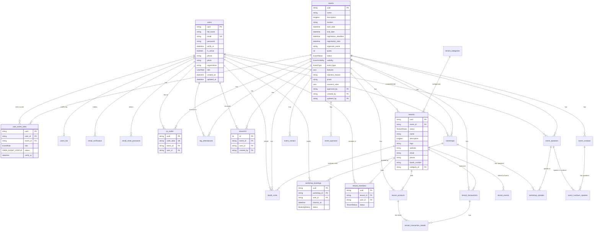

# Mexpo — Data Schema

> **Source:** `dev-backend-mexpo-new/prisma/schema.prisma` (Prisma 7, **MySQL/MariaDB** provider). This is the live, source-of-truth schema. The docx contains **no tables** — it only describes config objects (`EventVisibility`, `TicketMode`, `{limited, quota}`, souvenir rule objects). Those are listed in §3 as "docx-only, not in DB".
>
> Naming note: Prisma models here are snake_case table names (Prisma `model users` → table `users`, etc.). Relation fields are camelCase. All UUIDs are `String @default(uuid())`.
>
> `> ⚠️ CONTRADICTION:` callouts mark spec-vs-schema gaps.

---

## 1. ER Diagram (mermaid)

---

## 2. Table-by-Table Breakdown

All tables carry Prisma defaults where noted. `@updatedAt` means the column is auto-set on update.

### 2.1 `users`
| Column | Type | Constraints | Notes |
|---|---|---|---|
| `uuid` | String | PK, `@default(uuid())` | |
| `full_name` | String | `@default("")` | |
| `email` | String | **UNIQUE**, `@default("")` | login identifier |
| `password` | String | `@default("")` | bcrypt hash (10 rounds) |
| `verify_at` | DateTime | nullable | email verification timestamp |
| `is_active` | Boolean | `@default(false)` | false until verified |
| `phone` | String | `@default("")` | |
| `photo` | String | `@default("")` | S3/MinIO URL |
| `organization` | String | `@default("")` | |
| `role` | enum `UserRole` | `@default(USER)` | `SUPERADMIN \| USER` |
| `created_at` / `updated_at` | DateTime | `@default(now())` / `@updatedAt` | |

Relations: `users_bio` (1:1), all audit FKs (`creator_*`/`editor_*` on ~20 tables), `user_event_roles`, `email_verification`, `email_reset_password`, `qr_codes`, `workshop_bookings`, `booth_visits`, `log_attendances`, `souvenirs`, `tenant_members`.

### 2.2 `users_bio`
| Column | Type | Constraints | Notes |
|---|---|---|---|
| `uuid` | String | PK | |
| `city` | String? | nullable | |
| `role_type` | enum `RoleType`? | nullable | `PARTICIPANT \| SUPERVISOR` |
| `destination_country` | String? | nullable | |
| `departure_month` | enum `departureMonth`? | nullable | Januari…Desember (Indonesian month names) |
| `user_id` | String | **UNIQUE**, FK → `users.uuid`, `onDelete: Cascade` | |

> ⚠️ **CONTRADICTION/`[NEEDS CLARIFICATION]`:** `users_bio` exists **only** to serve a hardcoded event UUID in `public-api` registration. The docx's "Dynamic Registration Form" (per-event fields) is `[PLANNED]`; this table is not a generic dynamic-form implementation.

### 2.3 `email_verification` / `email_reset_password`
| Column | Type | Constraints | Notes |
|---|---|---|---|
| `uuid` | String | PK, `@default(uuid())` | token itself |
| `user_id` | String | FK → `users.uuid`, `onDelete: Cascade` | |
| `expiresAt` | DateTime | | 72h (verification) / 24h (reset) |

### 2.4 `events`
| Column | Type | Constraints | Notes |
|---|---|---|---|
| `uuid` | String | PK | |
| `slug` | String? | **UNIQUE** | URL segment `/event/<slug>`, `/dashboard/<slug>`; dibuat dari `name` |
| `name` | String | `@default("")` | |
| `description` | String | LongText | |
| `location` | String | `@default("")` | |
| `start_date` / `end_date` | DateTime | `@default(now())` | |
| `registration_deadline` | DateTime | `@default(now())` | |
| `registration_start` | DateTime? | nullable | |
| `organizer_name` | String | `@default("")` | |
| `quota` | Int | `@default(0)` | `0` = effectively unlimited; only checked on visitor self-registration |
| `status` | enum `EventStatus` | `@default(DRAFTED)` | `DRAFTED \| PENDING \| PUBLISHED \| REJECTED \| FINISHED` (since Sprint 2 / A3) |
| `visibility` | enum `EventVisibility` | `@default(PUBLIC)` | `PUBLIC \| PRIVATE` (A2); private events hidden from `public-api` |
| `event_type` | enum `EventType` | `@default(OTHER)` | `EXPO \| CAREER_FAIR \| SEMINAR \| GRADUATION \| EXHIBITION \| MARKETPLACE \| GOVERNMENT \| CAMPUS_SCHOOL \| OTHER` (A7) |
| `ticket_mode` | enum `TicketMode` | `@default(FREE)` | `FREE \| PAID` (A1, migration `20260808083739`) |
| `features` | JSON | nullable | A2 per-event feature toggles `{ tenant, seminar, souvenir, product, pos, paidTicket }`; absent key = enabled; gated in mutation endpoints |
| `rejection_reason` | String? | nullable | A3 — set when a super admin rejects a publish request |
| `photo` | String | `@default("")` | S3 URL |
| `souvenir_rules` | JSON | nullable | added by migration `20260808063221_add_souvenir_rules` (FIX-11); `{ minVisitedBooth?: number }` — default 5 |
| `approved_by` | String? | **nullable** FK → `users.uuid` | nullable since migration `20260808065131_make_approved_by_nullable` (FIX-13); set when the event is **published**, `NULL` until then |
| `created_by` / `updated_by` | String | FKs → `users.uuid`, `@default("")` | |

> ⚠️ **CONTRADICTION (partially resolved):** the docx "Event Configuration System" fields were entirely absent pre-Sprint 2. A2 added `visibility`, `features`, and A7 added `event_type`. Still **missing** vs docx: `ticketMode`/`paidTicket` columns (no ticket model — `paidTicket` only exists as a feature toggle), and `{limited, quota}` config object (only flat `quota`).

### 2.5 `user_event_roles`
| Column | Type | Constraints | Notes |
|---|---|---|---|
| `uuid` | String | PK | |
| `user_id` | String | FK → `users.uuid`, Cascade | |
| `event_id` | String | FK → `events.uuid`, Cascade | |
| `role` | enum `EventRole` | `@default(VISITOR)` | `OWNER \| COMMITTEE \| TENANT \| VISITOR` |
| `status` | enum `USER_EVENT_STATUS` | `@default(PENDING)` | `PENDING \| APPROVED \| REJECTED` |
| `verify_at` | DateTime? | nullable | |
| `created_by` / `updated_by` | String | FK audit, `@default("")` | |

> No unique constraint on `(user_id, event_id)` — duplicates prevented only by service logic.

### 2.6 `event_contact`
`uuid` PK · `event_id` FK → events · `name` · `email` · `phone_number` · audit `created_by/updated_by` · timestamps. — **code-only module** (not in docx).

### 2.7 `event_rundown`
`uuid` PK · `event_id` FK · `title` · `description` LongText · `start_time`/`end_time` DateTime · audit · timestamps. Relates to speakers via `event_rundown_speaker`.

### 2.8 `event_speakers`
`uuid` PK · `event_id` FK · `name` · `bio` LongText · `photo` · audit · timestamps.
> docx treats speakers as **users with accounts/QR**; schema treats them as content records only.

### 2.9 `event_rundown_speaker` (join)
`uuid` PK · `rundown_id` FK → event_rundown (Cascade) · `speaker_id` FK → event_speakers (Cascade) · audit · timestamps.

### 2.10 `event_sponsors`
`uuid` PK · `event_id` FK · `name` · `logo` · `level` enum `SponsorLevel` `@default(PLATINUM)` (`PLATINUM/GOLD/SILVER/BRONZE`) · audit · timestamps. — **code-only** (not in docx).

### 2.11 `workshops` (the docx "seminar/session")
| Column | Type | Constraints | Notes |
|---|---|---|---|
| `uuid` | String | PK | |
| `slug` | String? | **UNIQUE** | dibuat dari `title` |
| `event_id` | String | FK → events, Cascade | |
| `title` | String | `@default("")` | |
| `description` | String | LongText | |
| `location` | String | `@default("")` | |
| `start_time` / `end_time` | DateTime | `@default(now())` | |
| `quota` | Int | `@default(0)` | `0` = unlimited |
| `is_public` | Boolean | `@default(true)` | |
| audit + timestamps | | | |

> docx "Multi Session Seminar" (1 seminar → many sessions) has no parent "seminar" entity. Workshops hang directly off `events`.

### 2.12 `workshop_speaker` (join)
`uuid` PK · `workshop_id` FK → workshops (Cascade) · `speaker_id` FK → event_speakers (Cascade) · audit · timestamps.

### 2.13 `workshop_bookings`
| Column | Type | Constraints | Notes |
|---|---|---|---|
| `uuid` | String | PK | |
| `workshop_id` | String | FK → workshops, Cascade | |
| `user_id` | String | FK → users, Cascade | |
| `checkin_at` | DateTime? | nullable | set on workshop check-in |
| `status` | enum `BookingStatus` | `@default(REGISTERED)` | `REGISTERED \| CHECKED_IN \| CANCELLED` |
| audit + timestamps | | | |

> No unique `(workshop_id, user_id)` — duplicates prevented by service check only.

### 2.14 `tenant_categories`
`uuid` PK · `name` · audit · timestamps · `tenants[]`. — **code-only** (not in docx; docx has no tenant category concept).

### 2.15 `tenants`
| Column | Type | Constraints | Notes |
|---|---|---|---|
| `uuid` | String | PK | |
| `slug` | String? | **UNIQUE** | dibuat dari `name` |
| `event_id` | String | FK → events, Cascade | |
| `status` | enum `TenantStatus` | `@default(PENDING)` | `PENDING \| APPROVED \| REJECTED` |
| `name` | String | `@default("")` | |
| `description` | String | LongText | |
| `logo` | String | `@default("")` | S3 |
| `website` | String | `@default("")` | |
| `email` | String | `@default("")` | |
| `phone` | String | `@default("")` | |
| `booth_number` | String | `@default("")` | |
| `category_id` | String? | FK → tenant_categories, Cascade, nullable | |
| audit + timestamps | | | |

> docx company profile includes **address** and **social media** — absent from schema.

### 2.16 `tenant_members`
`uuid` PK · `tenant_id` FK → tenants (Cascade) · `user_id` FK → users (Cascade) · `status` enum `TenantStatus` `@default(PENDING)` · **`role` enum `TenantMemberRole` `@default(STAFF)`** (`OWNER|STAFF`, Sprint 5/A13) · audit · timestamps.
> Creator auto-becomes OWNER; invited members are STAFF. Staff cannot delete products/transactions or manage members. Migration `20260808091933`.

### 2.17 `tenant_events` (join)
`uuid` PK · `tenant_id` FK → tenants (Cascade) · `event_id` FK → events (Cascade) · audit · timestamps.
> Note: `tenants` already has `event_id`; `tenant_events` is a many-to-many join that is not currently used by any service (no routes found touching it).

### 2.18 `tenant_products`
| Column | Type | Constraints | Notes |
|---|---|---|---|
| `uuid` | String | PK | |
| `tenant_id` | String | FK → tenants, Cascade | |
| `event_id` | String | FK → events, Cascade | denormalized |
| `name` | String | `@default("")` | |
| `description` | String | LongText | |
| `price` | Float | `@default(0)`, `@db.Double` | DTO enforces `@Min(0)` |
| `photo` | String | `@default("")` | S3 |
| audit + timestamps | | | |

### 2.19 `tenant_transactions`
| Column | Type | Constraints | Notes |
|---|---|---|---|
| `uuid` | String | PK | |
| `event_id` | String | FK → events, Cascade | denormalized |
| `tenant_id` | String | FK → tenants, Cascade | |
| `amount` | Float | `@default(0)`, `@db.Double` | server-computed `Σ qty × price` |
| `transaction_date` | DateTime | `@default(now())` | |
| `payment_method` | String | `@default("")` | A14 — CASH / QRIS / TRANSFER (free-form) |
| `paid` | Boolean | `@default(false)` | A14 — payment status |
| `proof` | String | `@default("")` | S3 (uploaded proof/receipt) |
| audit + timestamps | | | |

> `paid` + `payment_method` added in migration `20260808091933` (Sprint 5/A14). Payment methods are free-form; configurable-per-event is `[NEEDS CLARIFICATION]`.

### 2.20 `tenant_transaction_details`
| Column | Type | Constraints | Notes |
|---|---|---|---|
| `id` | **Int** | PK, `@default(autoincrement())` | only Int PK besides `souvenirs` |
| `transaction_id` | String | FK → tenant_transactions | |
| `product_id` | String | FK → tenant_products | |
| `quantity` | Float | `@default(0)`, `@db.Double` | DTO `@Min(1)` |
| `purchase_price` | Float | `@default(0)`, `@db.Double` | price snapshot at purchase |
| `created_at` / `updated_at` | DateTime | | no audit FKs |

### 2.21 `booth_visits`
`uuid` PK · `tenant_id` FK → tenants (Cascade) · `event_id` FK → events (Cascade) · `user_id` FK → users (Cascade) · audit · timestamps.
> Serves: tenant guest book, booth-visit count, and the hardcoded souvenir rule (count ≥ 5). Once/day/tenant enforced in service.

### 2.22 `log_attendances`
`uuid` PK · `event_id` FK → events (Cascade) · `user_id` FK → users (Cascade) · `created_at`/`updated_at`. — venue/event check-in log. Once/calendar-day per user per event.

### 2.23 `qr_codes`
| Column | Type | Constraints | Notes |
|---|---|---|---|
| `uuid` | String | PK | |
| `code_data` | String | **UNIQUE**, `@default("")` | intended QR payload |
| `event_id` | String | FK → events, Cascade | |
| `user_id` | String | FK → users, Cascade | |
| `created_at` / `updated_at` | DateTime | | |

> ✅ **WIRED (Sprint 4 / A4):** `src/qr-codes/` module — `GET /qr-codes/my/:event_id` lazily creates the row with `code_data = mexo:<event_id>:<user_id>` (globally unique) and returns a PNG data URL; `POST /qr-codes/resolve` resolves a scanned code to `{ user_id, event_id, user }` (also parses the format when no row exists). The same QR is universal for venue/workshop/booth check-in.

### 2.24 `souvenirs`
| Column | Type | Constraints | Notes |
|---|---|---|---|
| `id` | **Int** | PK, `@default(autoincrement())` | |
| `event_id` | String | FK → events, Cascade | |
| `user_id` | String | FK → users, Cascade | |
| `created_by` / `updated_by` | String | FK audit | |
| `created_at` / `updated_at` | DateTime | | |

> No rule columns, no redemption metadata (when/how granted), no claim status. Uniqueness is service-enforced.

### 2.25 `ticket_types` (Sprint 3 / A1)
| Column | Type | Constraints | Notes |
|---|---|---|---|
| `uuid` | String | PK | |
| `event_id` | String | FK → events, Cascade | |
| `name` | String | `@default("")` | |
| `price` | Float | `@default(0)`, `@db.Double` | DTO `@Min(0)` |
| audit + timestamps | | | |

### 2.26 `tickets` (Sprint 3 / A1)
| Column | Type | Constraints | Notes |
|---|---|---|---|
| `uuid` | String | PK | |
| `event_id` | String | FK → events, Cascade | |
| `user_id` | String | FK → users, Cascade | |
| `ticket_type_id` | String? | FK → ticket_types, `onDelete: SetNull`, `@default("")` | nullable — free events have no type |
| `status` | enum `TicketStatus` | `@default(RESERVED)` | `RESERVED \| PAID \| CANCELLED` |
| `payment_reference` | String | `@default("")` | manual/POS reference (no gateway yet) |
| `payment_method` | String | `@default("")` | CASH / QRIS / TRANSFER (free-form) |
| audit + timestamps | | | |

### 2.27 `event_registration_fields` (Sprint 3 / A8)
| Column | Type | Constraints | Notes |
|---|---|---|---|
| `uuid` | String | PK | |
| `event_id` | String | FK → events, Cascade | |
| `field_key` | String | `@default("")` | unique per event (service-enforced) |
| `label` | String | `@default("")` | |
| `type` | enum `RegistrationFieldType` | `@default(TEXT)` | `TEXT \| TEXTAREA \| NUMBER \| EMAIL \| SELECT \| DATE \| BOOLEAN` |
| `required` | Boolean | `@default(false)` | |
| `options` | JSON? | nullable | SELECT options |
| `position` | Int | `@default(0)` | ordering |
| audit + timestamps | | | |

### 2.28 `registration_answers` (Sprint 3 / A8)
| Column | Type | Constraints | Notes |
|---|---|---|---|
| `uuid` | String | PK | |
| `event_id` | String | FK → events, Cascade | |
| `user_id` | String | FK → users, Cascade | |
| `field_key` | String | `@default("")` | references `event_registration_fields.field_key` |
| `value` | String | `@default("")` | |
| audit + timestamps | | | |

### 2.29 `contact_message` (form kontak publik — `POST /contact`)
| Column | Type | Constraints | Notes |
|---|---|---|---|
| `uuid` | String | PK | |
| `name` | String | `@default("")` | |
| `email` | String | `@default("")` | |
| `subject` | String | `@default("")` | |
| `message` | String | `@db.Text` | pesan pengunjung |
| `ip_address` | String | `@default("")` | untuk rate-limit/audit |
| `created_at` | DateTime | `@default(now())` | |

> Tidak ada `created_by`/`updated_by` (FK → users) karena pengirim **bukan user terdaftar**. Migrasi: `prisma/migrations-mysql/20260815000000_add_contact_message`.

### 2.30 `certificate_templates` (template sertifikat A10 — Konva designer)
| Column | Type | Constraints | Notes |
|---|---|---|---|
| `uuid` | String | PK | |
| `event_id` | String | FK → events, Cascade | `certificateTemplates[]` on `events` |
| `name` | String | `@default("")` | nama template (label UI) |
| `kind` | String | `@default("WORKSHOP")` | `WORKSHOP \| PARTICIPANT` (cadangan: SPEAKER/COMMITTEE) |
| `template` | Json? | nullable | envelope Konva: `{version:1, width, height, background, nodes[]}` + `attrs.binding` pada Text |
| `background` | String | `@default("")` | URL gambar latar (S3 bucket `expo-project-certificate`); ikut dihapus saat delete |
| `is_active` | Boolean | `@default(true)` | template dipakai untuk render sertifikat |
| audit + timestamps | | | `created_by`/`updated_by` FK → users |

> Binding key dinamis **divalidasi server** (whitelist di `certificates.service.ts`): `participant_name`, `event_name`, `workshop_title`, `date`, `organizer_name`, `certificate_number`.
> Migrasi: `prisma/migrations/20260820000000_add_certificate_templates` (Postgres) & `prisma/migrations-mysql/20260820000000_add_certificate_templates` (MySQL).

### 2.31 `transactions` (payment intent Midtrans Snap — A1b)
| Column | Type | Constraints | Notes |
|---|---|---|---|
| `uuid` | String | PK | |
| `event_id` | String | FK → events, Cascade | |
| `user_id` | String | FK → users, Cascade | |
| `ticket_id` | String? | FK → tickets, SetNull | 1:M — beberapa attempt per tiket diizinkan |
| `midtrans_order_id` | String | **UNIQUE** | format `MXP-<uuid tanpa dash uppercase>` |
| `amount` | Int | `@default(0)` | IDR integer dari `ticket_types.price` (server) |
| `platform_fee` | Int | `@default(0)` | potongan platform sebelum payout (%) |
| `status` | enum `TransactionStatus` | `@default(PENDING)` | `PENDING \| PAID \| EXPIRED \| FAILED \| REFUNDED` |
| `payment_method` | String | `@default("")` | diisi webhook (`payment_type` Midtrans) |
| `snap_token` | String | `@db.Text` | token Snap (panjang, wajib TEXT) |
| `paid_at` / `expired_at` / `refunded_at` | DateTime? | nullable | |
| `refund_reason` | String | `@default("")` | |
| audit + timestamps | | | `created_by`/`updated_by` FK → users |

> Migrasi: `prisma/migrations/20260826000000_add_payments` (Postgres) & `prisma/migrations-mysql/20260826000000_add_payments` (MySQL).
> Status final hanya ditulis dari `PENDING` (idempotent). Webhook signature SHA512 di `payments/midtrans.service.ts`.

### 2.32 `event_settlements` (payout manual oleh SUPERADMIN — A1b)
| Column | Type | Constraints | Notes |
|---|---|---|---|
| `uuid` | String | PK | |
| `event_id` | String | FK → events, Cascade | |
| `amount_transferred` | Int | `@default(0)` | harus = net summary |
| `transferred_by` | String | FK → users | SUPERADMIN yang transfer |
| `proof_of_transfer` | String | `@default("")` | URL S3 bucket `expo-project-payment` |
| `note` | String | `@default("")` | |
| `created_at` | DateTime | `@default(now())` | |

> Kolom `events.payout_*` (`payout_bank_name`, `payout_account_number`,
> `payout_account_holder`, `payout_status`, `settled_at`) menyimpan rekening
> organizer dan status escrow. Sumber organizer = `events.created_by`.

---

## 3. docx-Only Concepts (not in schema)

| docx concept | Proposed shape (docx) | Status in schema |
|---|---|---|
| Event visibility | `EventVisibility = 'public' \| 'private'` | **DONE** — `events.visibility` (Sprint 2 / A2) |
| Registration quota config | `{ limited: true, quota: 3000 }` | Only `quota` Int; no `limited` boolean |
| Ticket mode | `TicketMode = 'free' \| 'paid'` | **DONE** — `events.ticket_mode` + `ticket_types` + `tickets` (Sprint 3 / A1) |
| Feature toggles | `{ tenant, seminar, souvenir, product, pos, paidTicket }` | **DONE** — `events.features` JSON (Sprint 2 / A2) + endpoint gating |
| Event lifecycle | draft → pending → published → rejected/finished | **DONE** — `EventStatus` includes `PENDING`/`REJECTED` (Sprint 2 / A3) + publish-request/approval endpoints |
| Event type | 8+ event types | **DONE** — `events.event_type` enum (Sprint 2 / A7) |
| Souvenir rules | `{ minVisitedBooth, minTransaction, joinedSeminar, ... }` | **Partial** — `events.souvenir_rules` JSON column added (FIX-11), only `minVisitedBooth` evaluated |
| Attendance types | `venue_checkin \| seminar_checkin \| tenant_checkin \| visitor_booth_visit \| souvenir_claim` | Implicit via 3 tables; `souvenir_claim` missing |
| Payment methods | cash / QRIS / transfer | **Partial→DONE** — free-form `tickets.payment_method` (CASH/QRIS/TRANSFER) remain as manual fallback; **Midtrans Snap gateway added** (`transactions` + `event_settlements` + `events.payout_*`, Sprint 6 follow-up / A1b) — see `docs/PAYMENT.md` |
| Tenant address/social | profile fields | Missing |
| Tenant roles | owner / staff | Missing (`tenant_members` has no role) |
| Speaker account + QR | speaker as user | Missing (speakers are content rows) |
| Certificates / badges / dynamic forms | suggested features | **Partial** — dynamic registration form **DONE** (`event_registration_fields` + `registration_answers`, Sprint 3 / A8); **certificate templates DONE** (`certificate_templates`, Sprint 6 follow-up / A10 upgrade — Konva designer + bound dynamic fields); badges are an ID-badge PDF, **no badge template engine yet** |

---

## 4. Migrations

- **Hybrid DB (Option A):** the provider is chosen per environment from `DB_PROVIDER` (mysql|postgresql). Before building/migrating, the schema datasource provider must match — run `npm run db:provider:mysql` / `npm run db:provider:postgres` (edits `prisma/schema.prisma` + regenerates the client).
- **Connection:** built from individual parameters `DB_HOST` / `DB_PORT` / `DB_USER` / `DB_PASSWORD` / `DB_NAME` (+ `DB_SSLMODE` for Postgres, default `no-verify`) in `src/helper/db-provider.ts`. A full `DATABASE_URL` still overrides the params (backward compatible). Both `prisma.config.ts` (CLI) and `src/prisma/prisma.service.ts` (runtime) use the same `getDatabaseUrl()`.
- Migration sets are per provider, selected in `prisma.config.ts`:
  - `prisma/migrations/` → PostgreSQL (`migrate deploy` applied via CI).
  - `prisma/migrations-mysql/` → MySQL (generated from the same portable schema).
- The schema is portable: no provider-only native types (`@db.Text` is valid on both MySQL and Postgres; `Float` maps to `double` on both).
- `prisma/seed.ts` upserts 7 demo visitor users (`pengunjung1..7@gmail.com`, fixed UUIDs) and 7 APPROVED VISITOR `user_event_roles` rows for hardcoded event UUID `b63146f1-93a5-4381-8ca8-62a03fa5684e`.
- The CI deploy script runs `npx prisma migrate deploy` on the server (was `migrate dev --name init`, fixed).
- Runtime connection uses the driver adapter matching `DB_PROVIDER` (`@prisma/adapter-pg` vs `@prisma/adapter-mariadb`); `prisma.config.ts` (CLI: migrate/generate/seed) resolves the same URL. See `.env.example` for both connection styles (params or `DATABASE_URL`).
