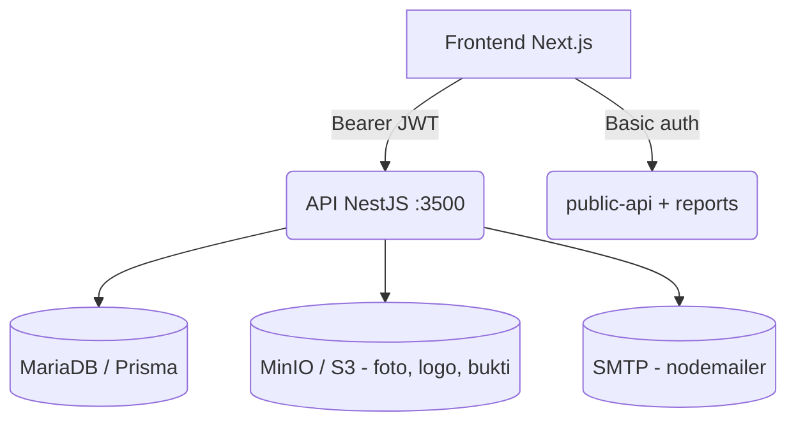

# Mexpo — Buku Panduan API & Desain Backend

> **Pembaca:** Developer frontend yang sedang mengintegrasikan aplikasi dengan backend Mexpo.
> Dokumen ini adalah panduan yang mudah dibaca manusia, pelengkap dari **Swagger UI** yang interaktif
> (selalu terbaru) dan diagram alur pengguna di `dev-backend-mexpo-new/docs/flows/*.mmd`.

---

## 1. Cara memakai dokumen ini

| Sumber | Tempat | Kegunaan |
|---|---|---|
| **Swagger UI** (interaktif) | `http://localhost:3500/docs` | Melihat dan mencoba semua endpoint, melihat **skema** permintaan/response (DTO + model Prisma) |
| **OpenAPI JSON** | `http://localhost:3500/docs-json` | Spesifikasi bentuk mesin; bisa diimpor ke Postman/Insomnia/Stoplight |
| **Buku panduan ini** | `dev-backend-mexpo-new/docs/api-handbook.md` / `.docx` | Konvensi, daftar endpoint, skema database, contoh, dan catatan penting |
| **Alur pengguna** | `dev-backend-mexpo-new/docs/flows/*.mmd` | Alur end-to-end dalam diagram Mermaid + langkah-langkah bernomor |

> **Skema database di dalam Swagger:** semua model Prisma sudah disuntikkan ke `components.schemas`
> pada dokumen OpenAPI. Buka `/docs-json` lalu cari nama model (misal `"events"`, `"user_event_roles"`)
> untuk melihat kolom dan tipenya dalam bentuk JSON Schema.

---

## 2. Gambaran sistem

- **Backend:** NestJS 11 + Prisma 7 (MySQL/MariaDB). Tidak ada awalan (prefix) global pada URL, tidak ada versi API.
- **Frontend:** Next.js 16 (App Router), berkomunikasi dengan backend lewat pembungkus kecil `httpRequest`.
- **Peran (level platform):** `SUPERADMIN`, `USER` (di kolom `users.role`).
- **Peran (per event, di `user_event_roles.role`):** `OWNER`, `COMMITTEE`, `TENANT`, `VISITOR`.
- **Alur utama:** daftar/verifikasi email → login → ikut event (atau membuat event) → persetujuan publikasi (SUPERADMIN) → peralatan di lokasi (scan QR check-in, booth, POS, souvenir) → laporan/export.

### 2.1 Arsitektur tingkat tinggi (Mermaid)



---

## 3. Model peran & izin

| Lingkup | Kolom | Nilai |
|---|---|---|
| Platform | `users.role` | `SUPERADMIN`, `USER` |
| Per event | `user_event_roles.role` | `OWNER`, `COMMITTEE`, `TENANT`, `VISITOR` |
| Per event | `user_event_roles.status` | `PENDING`, `APPROVED`, `REJECTED` |
| Tim tenant | `tenant_members.role` | `OWNER`, `STAFF` |
| Status tenant | `tenants.status` | `PENDING`, `APPROVED`, `REJECTED` |
| Keanggotaan (platform) | `users.is_active` | `true`/`false` |

Aturan otorisasi yang umum (diterapkan di service, bukan lewat mesin kebijakan terpusat):

- **CRUD event:** semua pengguna yang sudah login boleh `POST /events` (otomatis jadi OWNER); OWNER/COMMITTEE boleh mengubah; hanya OWNER yang boleh menghapus.
- **Publikasi:** owner/committee mengirim `POST /events/:id/publish-request` (status → `PENDING`); hanya `SUPERADMIN` yang menyetujui/menolak lewat `PUT /events/:id/approval`. Mengubah langsung ke `PUBLISHED` lewat update diblokir untuk non-superadmin.
- **Akses daftar (list):** sebagian besar endpoint list (mis. `/events/me`, `/tenants/:event_id`, `/workshops/:event_id`) mensyaratkan peminta adalah OWNER/COMMITTEE yang `APPROVED` untuk event tersebut (atau SUPERADMIN).
- **Khusus SUPERADMIN:** `GET /events/approval-queue`, `PUT /events/:id/approval`, semua route manajemen `/users/...`, dan `tenant-categories` (create/update/delete).

---

## 4. Konvensi API

### 4.1 URL dasar & environment

| Lingkungan | URL dasar |
|---|---|
| Local development | `http://localhost:3500` |
| Production | `https://mexpo-api.smktelkom-mlg.sch.id` |

Port diambil dari env `PORT` (default `3500`). **Tidak ada prefix global** (`POST /auth`, `GET /events`, dst).

### 4.2 Autentikasi

**Bearer JWT** (sebagian besar endpoint):
```
Authorization: Bearer <token>
```
- Dapatkan token dari `POST /auth` `{ email, password }` → `{ token }` (berlaku 1 hari).
- Isi JWT: `{ uuid, role }` (role = `SUPERADMIN` | `USER`).
- Klaim `role` diyakini tanpa dicek ulang ke database per permintaan.

**Basic auth** (untuk `public-api`, `reports`, `POST /users`, reset password):
```
Authorization: Basic base64(username:password)
```
- Kredensial berasal dari env backend `BASIC_AUTH_USERNAME` / `BASIC_AUTH_PASSWORD`.
- Di frontend, kredensial ini terekspos lewat `NEXT_PUBLIC_BASIC_AUTH_*` — anggap semi-publik.

### 4.3 Tipe konten & unggahan file

- Body JSON: `Content-Type: application/json`.
- Unggahan file: `multipart/form-data` dengan nama field **`file`**:
  - hanya gambar (`jpeg/jpg/png/gif`), maksimal **5 MB**.
  - Dipakai untuk: foto event, avatar user, logo tenant, foto produk, logo sponsor, foto pembicara (speaker), bukti transaksi.
- Satu pengecualian: `POST /tenant-transactions/:tenant_id` memakai `multipart/form-data` dengan field `detail_transactions` berupa **string JSON** (array berisi `{ product_id, quantity }`) yang diparsing di sisi server.

### 4.4 Format response

Response sukses (umumnya) memakai pembungkus seperti ini:
```json
{
  "success": true,
  "message": "Events retrieved successfully",
  "data": [...],          // atau satu objek
  "meta": { "page": 1, "quantity": 10, "counts": 42 }
}
```
- Bentuk `data` berbeda-beda tiap endpoint — lihat Swagger untuk tipe persisnya.
- Export Excel mengembalikan binary `.xlsx` dengan header `Content-Disposition: attachment`.
- Endpoint kesehatan akar `GET /` mengembalikan string biasa.

### 4.5 Error (kesalahan)

- **Validasi:** 400 dengan pesan berawalan `error validation:` (dari `ValidationPipe` bersama):
  ```json
  { "statusCode": 400, "message": "error validation: email must be an email, name should not be empty", "error": "Bad Request" }
  ```
- **Auth:** 401 `{ statusCode:401, message:"Unauthorized" }`; **Forbidden:** 403.
- **Not found / conflict:** 404 / 409 dengan `message` yang menjelaskan alasannya.
- **Server error:** 500 `"Something were wrong. …"` (perhatikan tulisan aslinya memang seperti itu, bukan salah ketik dari kita).

### 4.6 Pagination, pencarian, pengurutan & filter tanggal

| Param query | Arti |
|---|---|
| `page` | nomor halaman (mulai dari 1) |
| `quantity` | jumlah item per halaman (default bervariasi; UI memakai 10) |
| `search` | pencarian teks bebas (kolom yang dicari beda tiap endpoint) |
| `sort_by` | kolom pengurutan (whitelist, lihat catatan) |
| `sort_dir` | `asc` / `desc` |
| `start_date` / `end_date` | filter rentang tanggal (tanggal akhir bersifat inklusif, +1 hari di server) |

> **Dukungan sort (whitelist tiap modul):**
> - `events` (`/events/me`): `name`, `start_date`, `created_at`, `updated_at`
> - `users`: `full_name`, `email`, `created_at`
> - `event-users`: `full_name`, `role`, `created_at`
> - `workshops`: `title`, `start_time`, `created_at`
> - `attendances` (`/attendances/event`): `created_at`, `full_name`
> - `tenant-transactions`: `transaction_date`, `amount`, `created_at`
> Nilai `sort_by` yang tidak dikenal akan otomatis memakai urutan default endpoint.

`meta.counts` adalah **total jumlah baris** (pakai ini untuk UI pagination).

### 4.7 Enum yang dipakai API

| Nama | Nilai |
|---|---|
| `UserRole` | `SUPERADMIN`, `USER` |
| `EventStatus` | `DRAFTED`, `PENDING`, `PUBLISHED`, `REJECTED`, `FINISHED` |
| `EventVisibility` | `PUBLIC`, `PRIVATE` |
| `EventType` | `EXPO`, `CAREER_FAIR`, `SEMINAR`, `GRADUATION`, `EXHIBITION`, `MARKETPLACE`, `GOVERNMENT`, `CAMPUS_SCHOOL`, `OTHER` |
| `TicketMode` | `FREE`, `PAID` |
| `EventRole` | `OWNER`, `COMMITTEE`, `TENANT`, `VISITOR` |
| `USER_EVENT_STATUS` | `PENDING`, `APPROVED`, `REJECTED` |
| `BookingStatus` | `REGISTERED`, `CHECKED_IN`, `CANCELLED` |
| `TenantStatus` | `PENDING`, `APPROVED`, `REJECTED` |
| `TenantMemberRole` | `OWNER`, `STAFF` |
| `SponsorLevel` | `PLATINUM`, `GOLD`, `SILVER`, `BRONZE` |
| `TicketStatus` | `RESERVED`, `PAID`, `CANCELLED` |
| `RegistrationFieldType` | `TEXT`, `TEXTAREA`, `NUMBER`, `EMAIL`, `SELECT`, `DATE`, `BOOLEAN` |
| `Metode pembayaran` (string bebas) | `CASH`, `QRIS`, `TRANSFER` |

### 4.8 Catatan & keanehan yang perlu diketahui (baca sebelum mulai coding)

1. Route backend tertulis **`commitee`** (`GET /events/commitee/me`) — ini URL publik, jangan "diperbaiki".
2. **Tickets** berada di **root** (`/ticket-types/...`, `/tickets/...`), bukan di bawah prefix controller `/tickets`.
3. `souvenirs.id` berupa **integer** auto increment (bukan UUID) — `GET/DELETE /souvenirs/:id` memakai angka.
4. `tenant_transaction_details.id` juga integer auto increment.
5. Attendance **tidak terpusat** — ada tiga konsep terpisah: check-in event (`log_attendances`), kunjungan booth (`booth_visits`), dan check-in workshop (`workshop_bookings.status → CHECKED_IN`).
6. Workshop/seminar = **`workshops`** di skema/API (di dokumen produk disebut "seminar").
7. Kolom bertipe JSON (`features`, `souvenir_rules`, `options`/`condition` field) — kirim JSON asli di body, bukan string.

---

## 5. Daftar endpoint (per modul)

> Keterangan metode — Kolom Auth: `JWT` = pakai Bearer token, `Basic` = Basic auth, `SA` = khusus SUPERADMIN, `Pub` = tanpa auth.
> Semua tanggal dikembalikan sebagai string ISO-8601. Sebagian besar endpoint list mendukung `page/quantity/search` (+ tambahan yang dicantumkan).

### 5.1 Auth (Login)

| Method | Path | Auth | Body / Query | Keterangan |
|---|---|---|---|---|
| `POST` | `/auth` | Pub | `AuthDTO { email, password }` | Login → `{ token, ... }` |
| `POST` | `/auth/google` | Pub (self-verifying) | `GoogleAuthDto { credential }` | Google GIS id_token → verifikasi (`google-auth-library`, wajib `email_verified` + `aud` = client id) → findOrCreate user by email (granted aktif otomatis) → `{ token, role, is_new, user }` |

### 5.2 Users (Pengguna)

| Method | Path | Auth | Body / Query | Keterangan |
|---|---|---|---|---|
| `POST` | `/users` | Basic | `CreateUserDto`, file? | Mendaftarkan user biasa (`USER`) |
| `POST` | `/users/superadmin` | Basic | `CreateUserDto`, file? | Mendaftarkan `SUPERADMIN` |
| `POST` | `/users/reset-password` | Basic | `ResetPasswordDto { email }` | Mengirim email reset password |
| `POST` | `/users/reset-password/verify` | Basic | `VerifyResetPasswordDto` | Reset password memakai token |
| `GET` | `/users` | JWT, SA | `QueryUserDto` (search, is_active, sort) | Daftar akun role `USER` |
| `GET` | `/users/superadmin` | JWT, SA | `QueryUserDto` | Daftar akun `SUPERADMIN` |
| `GET` | `/users/verification/:code` | Pub | — | Verifikasi email (token) |
| `GET` | `/users/me` | JWT | — | Profil sendiri |
| `GET` | `/users/:id` | JWT, SA | — | Ambil satu user |
| `PUT` | `/users/me` | JWT | `UpdateUserDto`, file? | Update profil/foto sendiri |
| `PUT` | `/users/:id` | JWT, SA | `UpdateUserDto`, file? | Update user (aktif/nonaktif) |
| `DELETE` | `/users/:id` | JWT, SA | — | Hapus user |

### 5.3 Events (Event)

| Method | Path | Auth | Body / Query | Keterangan |
|---|---|---|---|---|
| `POST` | `/events` | JWT | `CreateEventDto`, file? | Buat event → pembuat jadi OWNER |
| `GET` | `/events` | JWT, SA | `QueryEventDto` | Daftar semua event (SA) |
| `GET` | `/events/me` | JWT | `QueryEventDto` | Event milik saya (OWNER/COMMITTEE/VISITOR/TENANT) |
| `GET` | `/events/visitor/me` | JWT | `QueryEventDto` | Event saya sebagai VISITOR |
| `GET` | `/events/commitee/me` | JWT | `QueryEventDto` | Event saya sebagai OWNER/COMMITTEE |
| `GET` | `/events/tenant/me` | JWT | `QueryEventDto` | Event saya sebagai TENANT |
| `GET` | `/events/approval-queue` | JWT, SA | `QueryEventDto` | Antrean permintaan publikasi |
| `POST` | `/events/:id/publish-request` | JWT | — | Ajukan publikasi (→ PENDING) |
| `PUT` | `/events/:id/approval` | JWT, SA | `ApproveEventDto { status, rejection_reason? }` | Setujui/Tolak publikasi |
| `GET` | `/events/me/:id` | JWT | — | Satu event (konteks saya) |
| `GET` | `/events/:id` | JWT | — | Satu event |
| `PUT` | `/events/:id` | JWT | `UpdateEventDto`, file? | Update event (status dibatasi) |
| `DELETE` | `/events/:id` | JWT | — | Hapus event (OWNER) |

`UpdateEventDto`/`CreateEventDto` berisi: `name, description, location, organizer_name, start_date, end_date, registration_start?, registration_deadline, quota, visibility, event_type, features {tenant, seminar, souvenir, product, pos, paidTicket}, souvenir_rules {minVisitedBooth, minTransaction?, joinedSeminar?, requireAll?}, ticket_mode`.

### 5.4 Event Users (peran di dalam event)

| Method | Path | Auth | Body / Query | Keterangan |
|---|---|---|---|---|
| `POST` | `/event-users/visitor/:event_id` | JWT | `CreateEventUserDto?` | Daftar diri sebagai visitor (dicek kuota) |
| `POST` | `/event-users/committee/:event_id` | JWT | `CreateEventUserDto` | Minta/assigned peran committee |
| `POST` | `/event-users/tenant/:event_id` | JWT | `CreateEventUserDto` | Minta peran tenant (→ PENDING) |
| `GET` | `/event-users/:event_id` | JWT | `QueryEventUserDto` (+ role, status, sort) | Daftar anggota beserta perannya |
| `PUT` | `/event-users/:id` | JWT | `UpdateEventUserDto { status, role? }` | Setujui/tolak/ubah peran |
| `DELETE` | `/event-users/:id` | JWT | — | Hapus anggota |

### 5.5 Konten event — Contacts / Rundowns / Sponsors / Speakers

| Method | Path | Auth | Body / Query | Keterangan |
|---|---|---|---|---|
| `POST` | `/event-contacts/:event_id` | JWT | `CreateEventContactDto` | Tambah kontak |
| `GET` | `/event-contacts/detail/:id` | JWT(any) | — | Detail kontak |
| `GET` | `/event-contacts/:event_id` | JWT | `QueryEventContactDto` | Daftar kontak |
| `PUT` | `/event-contacts/:id` | JWT | `UpdateEventContactDto` | Update kontak |
| `DELETE` | `/event-contacts/:id` | JWT | — | Hapus kontak |
| `POST` | `/event-rundowns/:event_id` | JWT | `CreateEventRundownDto { title, description, start_time, end_time }` | Tambah agenda |
| `POST` | `/event-rundowns/speaker/:id` | JWT | `AddSpeakerRundownDto { speaker_id }` | Tempel speaker ke agenda |
| `GET` | `/event-rundowns/detail/:id` | JWT | — | Detail rundown |
| `GET` | `/event-rundowns/:event_id` | JWT | `QueryEventRundownDto` | Daftar rundown |
| `PUT` | `/event-rundowns/:id` | JWT | `UpdateEventRundownDto` | Update rundown |
| `DELETE` | `/event-rundowns/speaker/:id` | JWT | — | Lepas speaker |
| `DELETE` | `/event-rundowns/:id` | JWT | — | Hapus rundown |
| `POST` | `/event-sponsors/:event_id` | JWT | `CreateEventSponsorDto { name, level }`, file? (logo) | Tambah sponsor |
| `GET` | `/event-sponsors/detail/:id` | JWT(any) | — | Detail sponsor |
| `GET` | `/event-sponsors/:event_id` | JWT | `QueryEventSponsorDto` | Daftar sponsor |
| `PUT` | `/event-sponsors/:id` | JWT | `UpdateEventSponsorDto`, file? | Update sponsor |
| `DELETE` | `/event-sponsors/:id` | JWT | — | Hapus sponsor |
| `POST` | `/event-speakers/:event_id` | JWT | `CreateEventSpeakerDto { name, bio }`, file? (foto) | Tambah pembicara |
| `GET` | `/event-speakers/profile/:id` | JWT(any) | — | Detail pembicara |
| `GET` | `/event-speakers/:event_id` | JWT | `QueryEventSpeakerDto` | Daftar pembicara |
| `PUT` | `/event-speakers/:id` | JWT | `UpdateEventSpeakerDto`, file? | Update pembicara |
| `DELETE` | `/event-speakers/:id` | JWT | — | Hapus pembicara |

### 5.6 Workshops & Bookings (Workshop & Pemesanan)

| Method | Path | Auth | Body / Query | Keterangan |
|---|---|---|---|---|
| `POST` | `/workshops/:event_id` | JWT | `CreateWorkshopDto { title, description, location, start_time, end_time, quota, is_public }` | Tambah workshop |
| `POST` | `/workshops/speaker/:workshop_id` | JWT | `AddSpeakerWorkshopDto { speaker_id }` | Tetapkan pembicara |
| `GET` | `/workshops/detail/:id` | JWT(any) | — | Detail workshop |
| `GET` | `/workshops/:event_id` | JWT | `QueryWorkshopDto` (+ sort) | Daftar workshop |
| `PUT` | `/workshops/:id` | JWT | `UpdateWorkshopDto` | Update workshop |
| `DELETE` | `/workshops/speaker/:id` | JWT | — | Hapus tautan pembicara |
| `DELETE` | `/workshops/:id` | JWT | — | Hapus workshop |
| `POST` | `/workshop-bookings/:workshop_id` | JWT | — | Pesan workshop (kuota, tidak boleh dobel) |
| `GET` | `/workshop-bookings/certificates/my/:event_id` | JWT | — | Sertifikat saya |
| `GET` | `/workshop-bookings/detail/:id` | JWT | — | Detail pemesanan |
| `GET` | `/workshop-bookings/:workshop_id` | JWT | `QueryWorkshopBookingDto` (difilter per workshop) | Daftar pemesan |
| `PUT` | `/workshop-bookings/:id` | JWT | `UpdateWorkshopBookingDto { status? }` | Update pemesanan (ada otorisasi) |
| `DELETE` | `/workshop-bookings/:id` | JWT | — | Batalkan pemesanan (ada otorisasi) |

### 5.7 Tenants, Members, Categories (Tenant, Anggota, Kategori)

| Method | Path | Auth | Body / Query | Keterangan |
|---|---|---|---|---|
| `POST` | `/tenants/:event_id` | JWT | `CreateTenantDto`, file? (logo) | Buat tenant (→ PENDING) |
| `POST` | `/tenants/invite/:tenant_id` | JWT | `InviteTenantDto { email }` | Undang rekan (akun dibuat otomatis, kredensial dikirim via email) |
| `GET` | `/tenants/mine/:event_id` | JWT | `QueryTenantDto` | Tenant saya di sebuah event |
| `GET` | `/tenants/:event_id` | JWT | `QueryTenantDto` | Daftar tenant di event |
| `GET` | `/tenants/members/:tenant_id` | JWT | `QueryTenantDto` | Daftar anggota tenant |
| `GET` | `/tenants/detail/:id` | JWT(any) | — | Detail tenant |
| `PUT` | `/tenants/verify/:id` | JWT | `VerifyTenantDto { status }` | Setujui/tolak tenant (status REJECTED dipertahankan, bukan dihapus) |
| `PUT` | `/tenants/verify/member/:id` | JWT | `VerifyTenantDto { status }` | Setujui/tolak anggota |
| `PUT` | `/tenants/member/:id` | JWT | `UpdateTenantMemberDto { role }` | Ubah peran anggota (OWNER/STAFF) |
| `PUT` | `/tenants/:id` | JWT | `UpdateTenantDto`, file? | Update profil tenant |
| `DELETE` | `/tenants/member/:id` | JWT | — | Hapus anggota |
| `DELETE` | `/tenants/:id` | JWT | — | Hapus tenant |
| `GET` | `/tenant-categories` | JWT | `QueryTenantCategoryDto` | Daftar kategori |
| `POST` | `/tenant-categories` | JWT, SA | `CreateTenantCategoryDto` | Buat kategori |
| `GET` | `/tenant-categories/:id` | JWT | — | Detail kategori |
| `PUT` | `/tenant-categories/:id` | JWT, SA | `UpdateTenantCategoryDto` | Update kategori |
| `DELETE` | `/tenant-categories/:id` | JWT, SA | — | Hapus kategori |

### 5.8 Products & POS Transactions (Produk & Transaksi POS)

| Method | Path | Auth | Body / Query | Keterangan |
|---|---|---|---|---|
| `POST` | `/tenant-products/:tenant_id` | JWT | `CreateTenantProductDto { name, description, price }`, file? (foto) | Tambah produk |
| `GET` | `/tenant-products/detail/:id` | JWT(any) | — | Detail produk |
| `GET` | `/tenant-products/:tenant_id` | JWT | `QueryTenantProductDto` (+ sort) | Daftar produk |
| `PUT` | `/tenant-products/:id` | JWT | `UpdateTenantProductDto`, file? | Update produk |
| `DELETE` | `/tenant-products/:id` | JWT | — | Hapus produk |
| `POST` | `/tenant-transactions/:tenant_id` | JWT | multipart: `detail_transactions` (string JSON `[{product_id, quantity}]`), `payment_method?` (CASH/QRIS/TRANSFER), `paid?`, `visitor_id?`, file? (bukti) | Buat transaksi POS (total dihitung server) |
| `GET` | `/tenant-transactions/detail/:id` | JWT(any) | — | Detail transaksi |
| `GET` | `/tenant-transactions/:tenant_id` | JWT | `QueryTenantTransactionDto` (+ start_date/end_date, search, sort) | Daftar transaksi |
| `PUT` | `/tenant-transactions/:id` | JWT | multipart: field update (mis. `paid`), file? | Update transaksi |
| `DELETE` | `/tenant-transactions/:id` | JWT | — | Hapus transaksi |

### 5.9 Attendances (Kehadiran)

| Method | Path | Auth | Body / Query | Keterangan |
|---|---|---|---|---|
| `POST` | `/attendances/event/:event_id` | JWT | `CreateAttendanceDto { user_id }` | Check-in event (sekali/hari) |
| `POST` | `/attendances/tenant/:tenant_id` | JWT | `CreateAttendanceDto { user_id }` | Kunjungan booth (sekali/hari/tenant) |
| `POST` | `/attendances/workshop/:workshop_id` | JWT | `CreateAttendanceDto { user_id }` | Check-in workshop (booking → CHECKED_IN) |
| `GET` | `/attendances/event/:event_id` | JWT | `QueryAttendanceDto` (+ start_date/end_date, search, sort) | Daftar check-in event |
| `GET` | `/attendances/workshop/:workshop_id` | JWT | `QueryAttendanceDto` | Daftar check-in workshop |
| `GET` | `/attendances/tenant/:tenant_id` | JWT | `QueryAttendanceDto` | Daftar kunjungan booth |

### 5.10 QR Codes (Kode QR)

| Method | Path | Auth | Body / Query | Keterangan |
|---|---|---|---|---|
| `GET` | `/qr-codes/my/:event_id` | JWT | — | QR milik saya sebagai data URL PNG (`code_data = mexo:<event>:<user>`) |
| `POST` | `/qr-codes/resolve` | JWT | `ResolveQrDto { code_data }` | Terjemahkan QR → identitas `{ user_id, user }` |

### 5.11 Souvenirs (Souvenir)

| Method | Path | Auth | Body / Query | Keterangan |
|---|---|---|---|---|
| `POST` | `/souvenirs/check/:event_id` | JWT | `CreateSouvenirDto { user_id }` | Cek kelayakan (aturan + sudah diklaim belum) |
| `POST` | `/souvenirs/:event_id` | JWT | `CreateSouvenirDto { user_id }` | Serahkan souvenir (satu per event) |
| `GET` | `/souvenirs/:event_id` | JWT | `QuerySouvenirDto` | Daftar souvenir event |
| `GET` | `/souvenirs/detail/:id` | JWT(any) | — | Detail (id = integer) |
| `DELETE` | `/souvenirs/:id` | JWT | — | Hapus (id = integer) |

### 5.12 Tickets (Tiket)

| Method | Path | Auth | Body / Query | Keterangan |
|---|---|---|---|---|
| `POST` | `/ticket-types/:event_id` | JWT | `CreateTicketTypeDto { name, price }` | Tambah jenis tiket |
| `GET` | `/ticket-types/:event_id` | JWT | `QueryTicketDto` | Daftar jenis tiket |
| `PUT` | `/ticket-types/:id` | JWT | `UpdateTicketTypeDto` | Update jenis tiket |
| `DELETE` | `/ticket-types/:id` | JWT | — | Hapus jenis tiket |
| `POST` | `/tickets/:event_id` | JWT | `BuyTicketDto { ticket_type_id?, payment_reference?, payment_method?, paid? }` | Daftar/beli tiket |
| `GET` | `/tickets/my/:event_id` | JWT | — | Tiket milik saya |
| `GET` | `/tickets/:event_id` | JWT | `QueryTicketDto` | Daftar tiket |
| `PUT` | `/tickets/:id` | JWT | `UpdateTicketDto` | Update tiket (status/pembayaran) |

### 5.13 Registration Fields (Formulir dinamis)

| Method | Path | Auth | Body / Query | Keterangan |
|---|---|---|---|---|
| `POST` | `/event-registration-fields/:event_id` | JWT | `CreateRegistrationFieldDto { field_key, label, type, required?, options?, condition?, position? }` | Tambah field |
| `GET` | `/event-registration-fields/:event_id` | JWT | `QueryRegistrationFieldDto` | Daftar field (urut berdasarkan position) |
| `PUT` | `/event-registration-fields/:id` | JWT | `UpdateRegistrationFieldDto` | Update field |
| `DELETE` | `/event-registration-fields/:id` | JWT | — | Hapus field |

### 5.14 Reports (Laporan)

| Method | Path | Auth | Query | Keterangan |
|---|---|---|---|---|
| `GET` | `/reports/booth/:event_id` | Basic | `FilterReportDto` | Jumlah pengunjung per booth |
| `GET` | `/reports/category/:event_id` | Basic | `FilterReportDto` | Jumlah pengunjung per kategori |
| `GET` | `/reports/visitor/:event_id` | Basic | `FilterReportDto` | Total pengunjung event |
| `GET` | `/reports/amount/booth/:event_id` | Basic | `FilterReportDto` | Nominal per booth |
| `GET` | `/reports/amount/category/:event_id` | Basic | `FilterReportDto` | Nominal per kategori |
| `GET` | `/reports/amount/:event_id` | Basic | `FilterReportDto` | Total nominal |
| `GET` | `/reports/export/:event_id` | Basic | `FilterReportDto` | **Export Excel** (xlsx) |
| `GET` | `/reports/export/:event_id/tenant/:tenant_id` | Basic | `FilterReportDto` | **Export Excel** satu tenant (xlsx) |

### 5.15 Public API (Basic auth)

| Method | Path | Auth | Body / Query | Keterangan |
|---|---|---|---|---|
| `POST` | `/public-api/registration/:event_id` | Basic | `CreateUserDto` + `answers[]` | Registrasi pengunjung (formulir dinamis; untuk PAID menerbitkan tiket) |
| `GET` | `/public-api/events` | Basic | `QueryPublicEventDto` (+ filter `event_type`, sembunyikan PRIVATE) | Daftar event publik |
| `GET` | `/public-api/events/active` | Basic | `QueryPublicEventDto` | Event yang aktif |
| `GET` | `/public-api/events/upcoming` | Basic | `QueryPublicEventDto` | Event yang akan datang |
| `GET` | `/public-api/events/:id` | Basic | — | Detail event publik (hanya PUBLIC) |
| `GET` | `/public-api/users/event/:event_id` | Basic | `QueryEventUserDto` | User yang terdaftar di event |
| `GET` | `/public-api/registration-fields/:event_id` | Basic | — | Skema formulir registrasi event |
| `GET` | `/public-api/ticket-types/:event_id` | Basic | — | Jenis tiket untuk event |

### 5.16 Certificate Templates (Template Sertifikat, A10)

> Desain sertifikat per event oleh OWNER/COMMITTEE menggunakan **Konva.js**.
> `template` adalah envelope stage yang terserialisasi: `{ version:1, width, height, background:{type:'color'|'image', value?, url?}, nodes[] }`.
> Teks dinamis memakai `attrs.binding`: `{type:'static', value}` (nilai default) atau `{type:'dynamic', key}` dengan `key` dari whitelist: `participant_name`, `event_name`, `workshop_title`, `date`, `organizer_name`, `certificate_number`. Key di luar whitelist ditolak server.

| Method | Path | Auth | Body / Query | Keterangan |
|---|---|---|---|---|
| `GET` | `/certificates/templates/active/:event_id` | JWT (anggota event) | — | Template aktif untuk render sertifikat (atau `null`) |
| `GET` | `/certificates/templates/:event_id` | JWT (OWNER/COMMITTEE) | `QueryCertificateTemplateDto { page, quantity }` | Daftar template |
| `POST` | `/certificates/templates/:event_id` | JWT (OWNER/COMMITTEE) | `CreateCertificateTemplateDto` + file? (latar) | Buat template |
| `PUT` | `/certificates/templates/:id` | JWT (OWNER/COMMITTEE) | `UpdateCertificateTemplateDto` + file? (latar) | Simpan template |
| `DELETE` | `/certificates/templates/:id` | JWT (OWNER/COMMITTEE) | — | Hapus template (latar S3 ikut dihapus) |

### 5.17 Payments — Midtrans Snap & Settlement (A1b)

> Escrow sederhana: dana peserta dipegang platform (akun Midtrans) lalu disetl
> manual ke rekening organizer oleh **SUPERADMIN**. Sumber harga selalu
> `ticket_types.price` (server). Detail & runbook sandbox di `docs/PAYMENT.md`.

| Method | Path | Auth | Body / Query | Keterangan |
|---|---|---|---|---|
| `POST` | `/events/:id/checkout` | JWT (VISITOR APPROVED) | `CheckoutDto { ticket_type_id? }` | Buat/pastikan tiket + payment intent + Snap token |
| `POST` | `/payment/notification` | tanpa guard (signature SHA512) | JSON/form | Webhook Midtrans — update status **idempotent** |
| `GET` | `/transactions/my/:event_id` | JWT (pemilik) | — | Transaksi saya + lazy-expiry |
| `GET` | `/transactions/:id` | JWT (pemilik/manager) | — | Status tunggal transaksi |
| `GET` | `/events/:id/transactions` | JWT (OWNER/COMMITTEE/SUPERADMIN) | `QueryTransactionDto { page, quantity, search }` | Daftar transaksi per event |
| `GET` | `/events/:id/settlement-summary` | JWT (OWNER/COMMITTEE/SUPERADMIN) | — | gross / fee / net / count / status / riwayat |
| `PUT` | `/events/:id/payout` | JWT (OWNER/COMMITTEE/SUPERADMIN) | `UpdatePayoutDto` | Simpan rekening payout organizer |
| `POST` | `/events/:id/settle` | **JWT (SUPERADMIN)** | `SettleDto { amount_transferred, note? }` + file? (bukti) | Catat settlement (jumlah harus = net) |
| `PUT` | `/transactions/:id/refund` | JWT (OWNER/COMMITTEE/SUPERADMIN) | `RefundTransactionDto { reason }` | Refund manual |

### 5.18 Contact (publik, tanpa auth)

| Method | Path | Auth | Body / Query | Keterangan |
|---|---|---|---|---|
| `POST` | `/contact` | Tanpa auth (publik) | `CreateContactMessageDto` (`name`, `email`, `subject`, `message`) | Form kontak publik: menyimpan pesan ke tabel `contact_message` DAN mengirim email notifikasi ke `CONTACT_DESTINATION_EMAIL` (default `tefa@smktelkom-mlg.sch.id`). Rate-limit in-memory per-IP **3 pesan/jam** → HTTP 429 |

### 5.19 Root / health (kesehatan aplikasi)

| Method | Path | Auth | Keterangan |
|---|---|---|---|
| `GET` | `/` | Pub | String kesehatan (via `AppController`) |

---

## 6. Skema database

> JSON Schema lengkap untuk setiap model juga tersedia di Swagger (`components.schemas.*`).
> Penamaan: tabel lowercase/snake_case; Prisma juga menyediakan kolom relasi berformat camelCase.
> `created_by`/`updated_by` menunjuk ke `users.uuid`; hampir semua tabel punya `created_at`/`updated_at`.
> Tanda `?` berarti kolom opsional/nullable.

### 6.1 Users & auth (Pengguna & autentikasi)

**users**
`uuid` string (PK) · `full_name` string · `email` string (unik) · `password` string (ter-hash) · `verify_at` date? · `is_active` boolean · `phone` string · `photo` string (URL) · `organization` string · `role` `UserRole` (SUPERADMIN|USER) · `created_at` · `updated_at`

**users_bio** (bio visitor lama — mengacu pada satu event; jangan diandalkan)
`uuid` (PK) · `city`? · `role_type` `RoleType`? · `destination_country`? · `departure_month` `departureMonth`? · `user_id` FK→users

**email_verification** / **email_reset_password**
`uuid` (PK) · `user_id` FK→users · `expiresAt` date

### 6.2 Events & konten event

**events**
`uuid` (PK) · `slug` String? (unik, URL: `/event/<slug>`, `/dashboard/<slug>`) · `name` · `description` (longtext) · `location` · `start_date` · `end_date` · `registration_deadline` · `registration_start`? · `organizer_name` · `quota` int (0=tanpa batas) · `status` `EventStatus` · `visibility` `EventVisibility` · `event_type` `EventType` · `ticket_mode` `TicketMode` (FREE|PAID) · `features` JSON? · `rejection_reason`? · `photo` (URL) · `souvenir_rules` JSON? · `approved_by`? FK→users · `created_by` FK · `updated_by` FK · timestamp

> **Identifier vs slug:** `GET /public-api/events/:id`, `GET /events/:id`, `GET /events/me/:id` (dan `detail/:id` untuk tenants/workshops) menerima **slug atau uuid**. `slug` otomatis dibuat dari `name`/`title` saat create dan di-sinkronkan saat nama berubah; uuid tetap PK internal dan dipakai untuk semua FK. Frontend memakai slug di URL, lalu memakai `event.uuid` untuk panggilan child-API.

**user_event_roles** (keanggotaan per event)
`uuid` (PK) · `user_id` FK · `event_id` FK · `role` `EventRole` · `status` `USER_EVENT_STATUS` · `verify_at`? · `created_by` · `updated_by` · timestamp

**event_contact**
`uuid` (PK) · `event_id` FK · `name` · `email` · `phone_number` · field audit

**event_rundown**
`uuid` (PK) · `event_id` FK · `title` · `description` (longtext) · `start_time` · `end_time` · field audit · relasi: `event_rundown_speaker[]`

**event_speakers**
`uuid` (PK) · `event_id` FK · `name` · `bio` (longtext) · `photo` (URL) · field audit · relasi: `event_rundown_speaker[]`, `workshop_speaker[]`

**event_rundown_speaker** (tabel gabung)
`uuid` (PK) · `rundown_id` FK →event_rundown · `speaker_id` FK →event_speakers · field audit

**event_sponsors**
`uuid` (PK) · `event_id` FK · `name` · `logo` (URL) · `level` `SponsorLevel` · field audit

### 6.3 Workshops (Workshop)

**workshops**
`uuid` (PK) · `slug` String? (unik) · `event_id` FK · `title` · `description` (longtext) · `location` · `start_time` · `end_time` · `quota` int (0=tanpa batas) · `is_public` boolean · field audit · relasi: `workshop_bookings[]`, `workshop_speaker[]`

**workshop_speaker** (tabel gabung)
`uuid` (PK) · `workshop_id` FK · `speaker_id` FK · field audit

**workshop_bookings**
`uuid` (PK) · `workshop_id` FK · `user_id` FK →users · `checkin_at`? · `status` `BookingStatus` (REGISTERED|CHECKED_IN|CANCELLED) · field audit

### 6.4 Tenants & POS

**tenant_categories**
`uuid` (PK) · `name` · field audit

**tenants**
`uuid` (PK) · `slug` String? (unik) · `event_id` FK · `status` `TenantStatus` · `name` · `description` (longtext) · `logo` (URL) · `website` · `email` · `phone` · `booth_number` · `category_id`? FK →tenant_categories · field audit · relasi: members/products/transactions/visits

**tenant_members**
`uuid` (PK) · `tenant_id` FK · `user_id` FK →users · `status` `TenantStatus` · `role` `TenantMemberRole` (OWNER|STAFF) · field audit

**tenant_events** (gabungan lama — lebih baik pakai user_event_roles)
`uuid` (PK) · `tenant_id` FK · `event_id` FK · field audit

**tenant_products**
`uuid` (PK) · `tenant_id` FK · `event_id` FK · `name` · `description` (longtext) · `price` float · `photo` (URL) · field audit

**tenant_transactions**
`uuid` (PK) · `event_id` FK · `tenant_id` FK · `amount` float (dihitung server) · `transaction_date` · `payment_method` string · `paid` boolean · `visitor_id`? FK →users (hasil scan QR di POS) · `proof` (URL) · field audit · relasi: details[]

**tenant_transaction_details**
`id` **integer** (PK, autoincrement) · `transaction_id` FK · `product_id` FK · `quantity` float · `purchase_price` float · timestamp

### 6.5 Attendance & QR (Kehadiran & QR)

**log_attendances** (check-in event)
`uuid` (PK) · `event_id` FK · `user_id` FK · timestamp

**booth_visits**
`uuid` (PK) · `tenant_id` FK · `event_id` FK · `user_id` FK · field audit

**qr_codes**
`uuid` (PK) · `code_data` string (unik, `mexo:<event>:<user>`) · `event_id` FK · `user_id` FK · timestamp

### 6.6 Souvenirs (Souvenir)

**souvenirs**
`id` **integer** (PK, autoincrement) · `event_id` FK · `user_id` FK →users · field audit · unik (event_id, user_id) dipastikan di service

### 6.7 Tickets & registrasi (Tiket & registrasi)

**ticket_types**
`uuid` (PK) · `event_id` FK · `name` · `price` float · field audit

**tickets**
`uuid` (PK) · `event_id` FK · `user_id` FK · `ticket_type_id`? FK →ticket_types · `status` `TicketStatus` (RESERVED|PAID|CANCELLED) · `payment_reference` · `payment_method` · field audit

**event_registration_fields**
`uuid` (PK) · `event_id` FK · `field_key` · `label` · `type` `RegistrationFieldType` · `required` boolean · `options` JSON? (untuk SELECT) · `condition` JSON? (`{field_key, value}` aturan tampil) · `position` int · field audit

**registration_answers**
`uuid` (PK) · `event_id` FK · `user_id` FK · `field_key` · `value` · field audit

**contact_message** (form kontak publik — `POST /contact`)
`uuid` (PK) · `name` · `email` · `subject` · `message` (longtext) · `ip_address` (untuk rate-limit/audit) · `created_at` — **tidak ada field audit** `created_by`/`updated_by` karena pengirim bukan `users` yang terdaftar

---

## 7. Alur pengguna

Setiap alur tersedia sebagai file Mermaid di `dev-backend-mexpo-new/docs/flows/`. Daftar langkah bernomor disertakan di sini dan di dalam docx; buka file `.mmd` di VS Code/GitHub/Mermaid Live untuk melihat diagramnya.

### 7.1 Autentikasi (`auth-flow.mmd`)
1. Pengunjung daftar: `POST /users` (Basic) `{ email, password, phone, ... }`.
2. Sistem mengirim email verifikasi → `GET /users/verification/:code`.
3. User login: `POST /auth` → Bearer JWT (berlaku 1 hari), disimpan di frontend.
4. Setiap panggilan API berikutnya menyertakan `Authorization: Bearer <token>`.

### 7.2 Siklus hidup event (`event-lifecycle.mmd`)
1. User yang sudah login membuat event `POST /events` (jadi OWNER, status `DRAFTED`).
2. Owner mengonfigurasi: update event (features, visibility, ticket_mode, aturan souvenir), menambah rundown/kontak/sponsor/pembicara/workshop.
3. Owner mengirim `POST /events/:id/publish-request` → status `PENDING`.
4. Superadmin memeriksa `GET /events/approval-queue` → `PUT /events/:id/approval` → `PUBLISHED` (atau `REJECTED` + alasan).
5. Event tampil di halaman publik.

### 7.3 Registrasi pengunjung (`visitor-registration.mmd`)
1. Frontend memuat event: `GET /public-api/events/:id`, `GET /public-api/registration-fields/:event_id`, `GET /public-api/ticket-types/:event_id`.
2. Pengunjung mengirim `POST /public-api/registration/:event_id` dengan data akun + `answers[]`.
3. Event `FREE` → dibuat baris `user_event_roles` (VISITOR); event `PAID` → diterbitkan tiket (`RESERVED`/`PAID`).
4. Jika sudah login, pengunjung juga bisa bergabung via `POST /event-users/visitor/:event_id`.

### 7.4 Pemesanan workshop (`workshop-booking.mmd`)
1. Pengunjung melihat workshop (`GET /public-api/events/:id` memuat workshop).
2. Sudah login → `POST /workshop-bookings/:workshop_id` (dicek kuota, tidak boleh dobel).
3. Check-in di lokasi: `POST /attendances/workshop/:workshop_id` → status booking `CHECKED_IN`.
4. Sertifikat tersedia lewat `GET /workshop-bookings/certificates/my/:event_id`.

### 7.5 Check-in QR (`check-in.mmd`)
1. Pengunjung mengambil QR: `GET /qr-codes/my/:event_id` (data URL PNG).
2. Petugas/tenant memindai (mis. `html5-qrcode`) → `POST /qr-codes/resolve` `{code_data}` → `{user_id}`.
3. Petugas: `POST /attendances/event/:event_id` (venue) memakai `user_id` hasil resolve.
4. Tenant: `POST /attendances/tenant/:tenant_id` (kunjungan booth).
5. Petugas souvenir: `POST /souvenirs/check/:event_id` lalu `POST /souvenirs/:event_id`.

### 7.6 Siklus hidup tenant (`tenant-lifecycle.mmd`)
1. Perusahaan mengajukan tenant: `POST /tenants/:event_id` (juga `POST /event-users/tenant/:event_id`) → `PENDING`.
2. Owner/committee menyetujui `PUT /tenants/verify/:id` → `APPROVED`; persetujuan anggota lewat route verify member.
3. Owner mengundang rekan via email `POST /tenants/invite/:tenant_id`; peran diubah via `PUT /tenants/member/:id`.
4. Tenant mengelola profil, produk, POS, laporan melalui portal.

### 7.7 Transaksi POS (`pos-transaction.mmd`)
1. Tenant membuka POS, opsional memindai QR pengunjung → `POST /qr-codes/resolve` → `visitor_id`.
2. Tenant mencatat item → `POST /tenant-transactions/:tenant_id` (multipart: `detail_transactions` string JSON, `payment_method`, `paid`).
3. Backend menghitung `amount` = Σ qty × harga lalu menyimpan detail.
4. Tenant mengganti status `paid` (`PUT /tenant-transactions/:id`) dan mencetak nota.

### 7.8 Penukaran souvenir (`souvenir-redemption.mmd`)
1. Petugas memindai QR pengunjung → resolve `user_id`.
2. `POST /souvenirs/check/:event_id` mengevaluasi aturan (`minVisitedBooth`, `joinedSeminar`, `requireAll`) + pengecekan sudah diklaim.
3. Memenuhi syarat → `POST /souvenirs/:event_id` memberikan satu souvenir (unik per event/user).
4. Tidak memenuhi → API mengembalikan pesan berisi aturan yang belum terpenuhi.

### 7.9 Laporan & export (`reports-export.mmd`)
1. Owner/committee membuka halaman Laporan (filter rentang tanggal).
2. Membaca ringkasan JSON: `/reports/booth|category|visitor|amount/.../:event_id`.
3. Mengunduh Excel: `GET /reports/export/:event_id` (event) atau `.../tenant/:tenant_id` (tenant).

---

## 8. Catatan integrasi frontend & hal yang perlu diwaspadai

1. **Dua jenis token, dua kondisi:** pakai Bearer untuk API dashboard; pakai Basic (kredensial statis) untuk `public-api`/`reports`. Pisahkan pembuat header Basic.
2. **URL dasar SSR vs browser:** `src/global.ts` memilih dev vs prod berdasarkan `typeof window`. Pastikan URL mana yang benar-benar dipakai build Anda sebelum mengandalkan fetch di sisi SSR.
3. **Alur login** menulis JWT ke dalam **cookie httpOnly** (server action). Kode klien membacanya via helper `http-token`/cookie — jangan coba membaca sebagai cookie biasa di JavaScript.
4. **Unggahan:** selalu `multipart/form-data` dengan nama field `file`; hanya gambar, maksimal 5 MB. Untuk create/update transaksi sertakan juga string JSON `detail_transactions` di dalam body multipart yang sama.
5. **Pagination:** baca `meta.counts` untuk total; kirim `page` + `quantity`. Selalu reset `page = 1` ketika `search`, filter, atau sort berubah.
6. **Sort:** hanya kolom pada §4.6 yang diterima; nilai lain otomatis memakai urutan default.
7. **Enum selalu HURUF BESAR** di response (misal `event.status = "PUBLISHED"`). Format tampilan dilakukan di sisi klien.
8. **`user_event_roles`** adalah sumber kebenaran untuk apa yang boleh dilihat/dilakukan user per event — dashboard memilah tampilan berdasarkan `role`.
9. **Penolakan bukan penghapusan:** tenant/anggota yang ditolak tetap ada dengan status `REJECTED`; filter di UI.
10. **`souvenirs.id` dan `tenant_transaction_details.id` adalah integer** — perlakukan sebagai angka, bukan UUID.

---

*Dibuat dari kode backend yang sebenarnya. Swagger UI di `/docs` adalah sumber kebenaran untuk skema terkini; perbarui buku panduan ini bila ada endpoint yang berubah.*