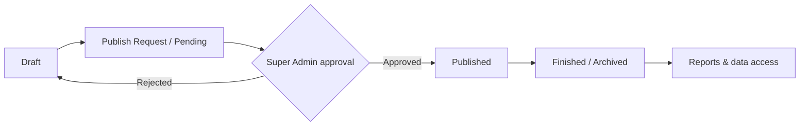
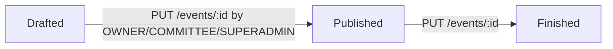
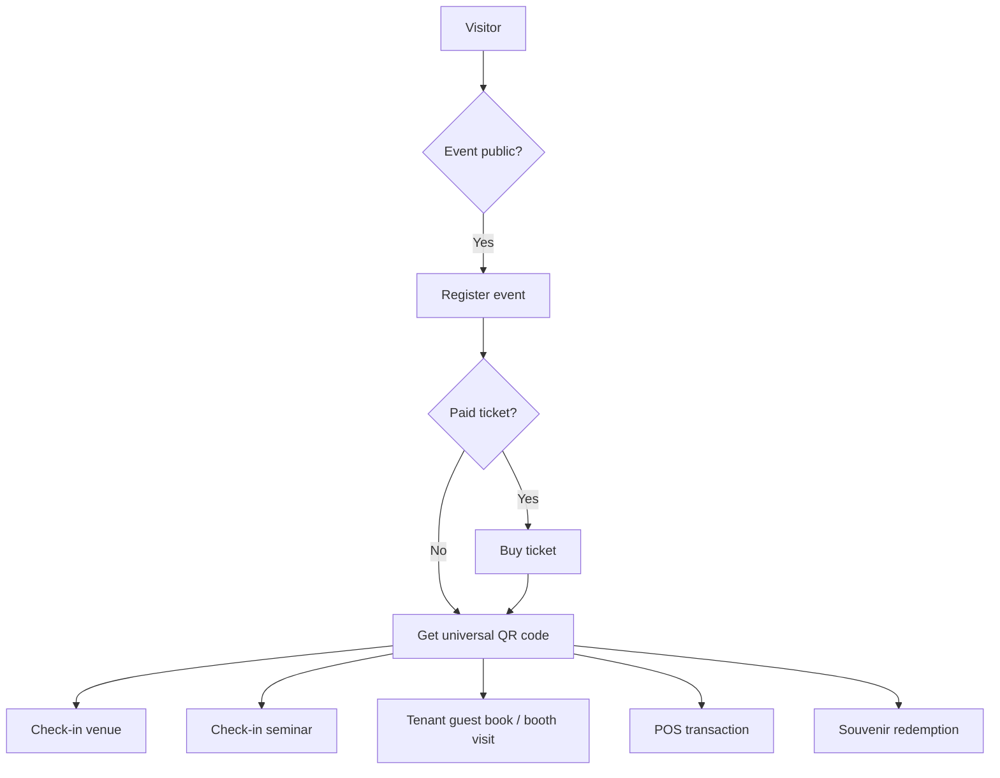
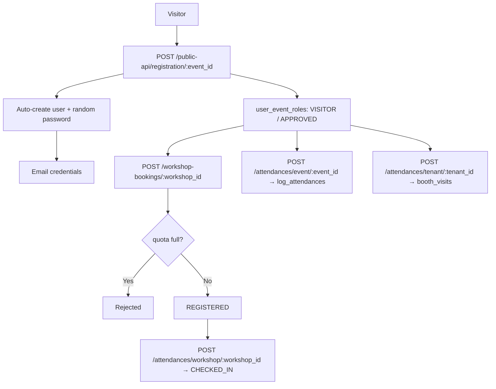
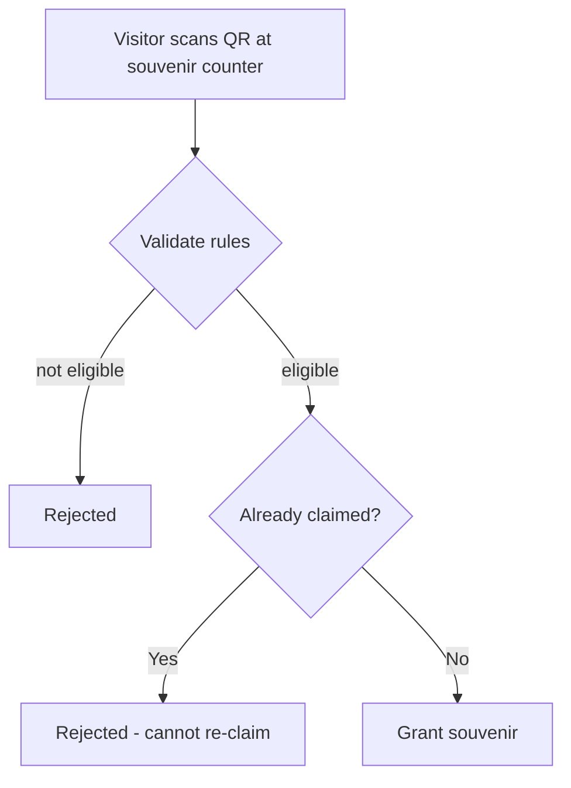

# Mexpo — Product Requirements Document (PRD)

> **Source matrix**
> - **`[docx]`** = `Mexpo — Product & Flow Revision Documentation.docx` (product spec)
> - **`[code]`** = actual implementation in `dev-backend-mexpo-new` (NestJS) + `dev-frontend-mexpo-new` (Next.js)
>
> Feature tags:
> - `[DONE]` — fully implemented and reachable in code
> - `[IN PROGRESS]` — partially implemented / implemented on backend only / unreachable UI
> - `[PLANNED]` — specified in docx only, not found in code
> - `[NEEDS CLARIFICATION]` — ambiguous or conflicting across sources
>
> `> ⚠️ CONTRADICTION:` callouts mark places where the docx spec and the actual code disagree. Do not silently pick one — read both before coding.

---

## 1. Background & Problem Statement

The current Mexpo platform is an event-browsing + registration web app built for a single event type (an Expo/graduation event — see the SMK Telkom Malang context: `PUBLIC_FRONTEND_URL` and the production API `mexpo-api.smktelkom-mlg.sch.id`).

The docx mandates a **restructuring** into a modular **Event Operating System** capable of serving many event types:

> Expo, Career Fair, Seminar, Graduation, Exhibition, Marketplace Event, Government Event, Campus/School Event

The system must be: **modular, configurable, feature-based, multi-role, scalable, subscription-ready, multi-event ready**. The docx explicitly states the system *"tidak boleh hardcoded untuk satu jenis event"* (must not be hardcoded for a single event type), and that all flows must be **configuration-driven, feature-driven, and permission-driven**.

**Current state (verified from code):** the platform *is* effectively hardcoded for one event profile — events have a fixed field set, no feature toggles, no event-type concept, hardcoded souvenir rules, and a hardcoded event UUID in `public-api` registration that forces `users_bio` fields for a specific event. This is exactly the "static system" the docx says must be refactored.

---

## 2. Goals & Non-Goals

### Goals (docx)
1. Restructure Mexpo into a modular Event Operating System supporting multiple event types. `[PLANNED]`
2. Make every event configurable: features on/off, visibility, quota, flow, ticket type, seminar/tenant/souvenir/POS config. `[PLANNED]`
3. Make all flows configuration-driven, feature-driven, and permission-driven. `[PLANNED]`
4. Add subscription-ready / premium-feature monetization scaffolding. `[PLANNED]`
5. Refactor the frontend to be modular, config-driven, widget-driven, permission-aware, and plugin-ready. `[PLANNED]`
6. Centralize attendance as a reusable QR-based system and reporting as a centralized analytics/export layer. `[PLANNED]`

### Non-Goals (derived — not stated in docx, inferred from "suggested"/"future" framing)
- Payment gateway integration (docx lists it as *future-ready*, code has none) — **not in the current build scope**.
- WhatsApp integration / custom third-party integrations (docx: *plugin ready / future*).
- Multi-tenant SaaS billing engine (docx only suggests monetization; no plan/pricing model is defined).
- Native mobile apps (no mention in either source).

---

## 3. User Roles & Personas

| Role | Source | Description | In code? |
|---|---|---|---|
| **Super Admin** | docx (implied: "approval super admin") | Approves publish requests; global platform management | `[DONE]` — `UserRole.SUPERADMIN`; manages users, all events, tenant categories |
| **Owner** | docx | Primary event organizer; creates events, sets config, manages committee/tenants/speakers | `[DONE]` — `EventRole.OWNER` |
| **Committee** | docx | Helps owner; permission-limited; check-ins, input data, manage attendees | `[DONE]` — `EventRole.COMMITTEE` (but see §7.3: permissions are NOT limited in code) |
| **Tenant** (owner + staff) | docx | Company/booth/exhibitor; profile, team, products, POS | `[DONE]` (owner-level) / `[PLANNED]` (staff roles) — `EventRole.TENANT` + `tenant_members`; no owner/staff role column |
| **Speaker** | docx | Seminar speaker; bio, QR, seminar analytics | `[DONE]` (entity only) / `[PLANNED]` (account/invite/QR) — `event_speakers` record |
| **Visitor** | docx | Event participant; register, buy tickets, seminar, souvenir | `[DONE]` — `EventRole.VISITOR` |

> ⚠️ **CONTRADICTION:** docx lists **5 roles** (Owner, Committee, Tenant, Speaker, Visitor) + a super admin approver. The code has **2 global roles** (`SUPERADMIN`, `USER`) and **4 per-event roles** (`OWNER`, `COMMITTEE`, `TENANT`, `VISITOR`). **Speaker is not a user/role in code** — it's a plain data row (`event_speakers`) with no login, no invite email, and no QR. Anyone with an account is `USER`; `USER` maps to any per-event role.

---

## 4. Feature List by Module

Legend: `[DONE]` · `[IN PROGRESS]` · `[PLANNED]` · `[NEEDS CLARIFICATION]`

### 4.1 Event Core

| # | Feature | Status | Evidence / Notes |
|---|---|---|---|
| E1 | Create event with basic details (name, description, location, dates, organizer) | `[DONE]` | `POST /events` (backend); `/dashboard/create` form (Sprint 2) |
| E2 | Event lifecycle: draft → pending → published → rejected/finished | `[DONE]` | `EventStatus` = `DRAFTED/PENDING/PUBLISHED/REJECTED/FINISHED` (Sprint 2/A3) |
| E3 | Publish **request** → super admin **approval** | `[DONE]` | `POST /events/:id/publish-request`, `PUT /events/:id/approval`, `GET /events/approval-queue` + frontend approval queue (Sprint 2/A3) |
| E4 | Event visibility `public`/`private` | `[DONE]` | `events.visibility` + public-api hides PRIVATE (Sprint 2/A2) |
| E5 | Registration quota (`{limited, quota}`) | `[DONE]`* | `events.quota` (Int) enforced on **both** `POST /event-users/visitor/:event_id` and `POST /public-api/registration/:event_id` (`quota > 0` = limited; 2026-08 closed the public-path bypass). The `limited` boolean / config object from docx still does not exist |
| E6 | Ticket type `free`/`paid` | `[DONE]` | `events.ticket_mode` + `ticket_types` + `tickets` models (Sprint 3/A1); paid tickets capture payment reference (manual/POS placeholder, no gateway) |
| E7 | Per-event feature toggles (tenant, seminar, souvenir, product, pos, paidTicket) | `[IN PROGRESS]` | `events.features` JSON + `assertEventFeature()` gating on mutations (Sprint 2/A2). Read endpoints not yet gated |
| E8 | Event type / multi-event-type support | `[DONE]` | `events.event_type` enum + public filter + home page filter (Sprint 2/A7) |
| E9 | Public event page (browse + detail) | `[DONE]` | `GET /public-api/events`, `GET /public-api/events/:id`; frontend `/` + `/event/[slug]` |
| E10 | My events per role | `[DONE]` | `GET /events/me`, `/events/visitor/me`, `/events/commitee/me`, `/events/tenant/me` |
| E11 | Event contacts / sponsors / rundowns | `[DONE]` | `event_contact`, `event_sponsors` (levels), `event_rundown` + speaker joins — **docx does not mention these modules**; they are code-only additions |
| E12 | Event photo upload (S3/MinIO) | `[DONE]` | Multipart upload, bucket `expo-project-event` |

> ⚠️ **CONTRADICTION (E2/E3) — RESOLVED in Sprint 2/A3:** docx lifecycle = `draft → pending (publish request) → published → finished` + `rejected`, with *"Owner harus submit publish request, menunggu approval super admin."* Now implemented: `PENDING`/`REJECTED` statuses, publish-request endpoint, super admin approval endpoint + queue, `approved_by` set at publish (FIX-13).

> ⚠️ **CONTRADICTION (E7) — PARTIALLY RESOLVED in Sprint 2/A2:** the feature-config object is now a real `events.features` JSON column with DTO validation and mutation gating. Remaining: read/gating gaps and no per-feature UI enforcement in all views.

### 4.2 User & Auth

| # | Feature | Status | Evidence |
|---|---|---|---|
| A1 | Register (email + password + phone) | `[DONE]` | `POST /users` (Basic guard) + frontend `/auth` register tab |
| A2 | Email verification | `[DONE]` | `email_verification` token, 72h expiry, `GET /users/verification/:code`, frontend `/verify-email` |
| A3 | Login → JWT | `[DONE]` | `POST /auth` → `{token, role}`, 1-day expiry. **Google sign-in added (2026-08):** `POST /auth/google` verifies a GIS id_token (google-auth-library, `email_verified` + `aud`), find-or-creates the user by email (auto-activated) and issues the same JWT |
| A4 | Reset password (email) | `[DONE]` | `POST /users/reset-password` + `/users/reset-password/verify`, 24h token |
| A5 | Profile (view/update own) | `[DONE]` | `GET/PUT /users/me` |
| A6 | User management (super admin) | `[DONE]` | `GET/PUT/DELETE /users`, `/users/superadmin` |
| A7 | Visitor bio fields (city, role_type, destination_country, departure_month) | `[DONE]`* | `users_bio` table; **hardcoded to a single event UUID** in `public-api` registration — `[NEEDS CLARIFICATION]` whether this is a general dynamic-form feature or event-specific hack |
| A8 | Dynamic registration form (per-event fields, conditional/required fields) | `[DONE]` | `event_registration_fields` + `registration_answers` + public schema + dynamic render; conditional (show-if) fields, condition (deferred in Sprint 3) shipped as follow-up. **Answers are readable by committee/owner since 2026-08** via `GET /event-users/:event_id` (`registrationAnswers[]` with human labels) and rendered in the dashboard Verification page |
| A9 | Badge generator (visitor/speaker/tenant) | `[DONE]` | `GET /qr-codes/my/:event_id` (PNG data URL) + ID badge UI at `/dashboard/[slug]/badge` |
| A10 | Certificate system | `[DONE]` | Certificate issued on workshop check-in; UI at `/dashboard/[slug]/certificates` (list + print) |

### 4.3 Event Roles & Permissions (Event-Users)

| # | Feature | Status | Evidence |
|---|---|---|---|
| P1 | Visitor self-registration to event | `[DONE]` | `POST /event-users/visitor/:event_id` (quota-checked); `POST /public-api/registration/:event_id` (public) |
| P2 | Owner assigns committee (email) / committee self-request | `[DONE]` | `POST /event-users/committee/:event_id` |
| P3 | Tenant self-request | `[DONE]` | `POST /event-users/tenant/:event_id` (PENDING) |
| P4 | Approve/reject roles | `[DONE]` | `PUT /event-users/:id`; REJECTED **deletes** the role row |
| P5 | Owner removal of members | `[DONE]` | `DELETE /event-users/:id` |
| P6 | Feature/permission-driven access (role + feature + plan) | `[PLANNED]` | No feature/plan-based permission logic; authorization is role-only and largely "OWNER/COMMITTEE or SUPERADMIN" |
| P7 | "Committee cannot delete owner / transfer ownership" guard | `[NEEDS CLARIFICATION]` | docx only. Code: only OWNER can `DELETE /events/:id` and `DELETE /event-users/:id`; there is **no transfer-ownership feature** at all |

### 4.4 Tenant Subsystem

| # | Feature | Status | Evidence |
|---|---|---|---|
| T1 | Create tenant | `[DONE]` | `POST /tenants/:event_id` (multipart logo) |
| T2 | Tenant categories | `[DONE]` | `tenant_categories` CRUD (super admin) — **code-only module**, not in docx |
| T3 | Invite tenant via email (auto-create account) | `[DONE]` | `POST /tenants/invite/:tenant_id`; creates user w/ random password + emails credentials |
| T4 | Tenant verify (approve/reject) | `[DONE]` | `PUT /tenants/verify/:id`; REJECTED **sets `REJECTED` status** (no row deletion, FIX-03) |
| T5 | Tenant company profile (name, logo, desc, website, phone, booth) | `[DONE]` | `PUT /tenants/:id` |
| T6 | Company profile fields: **address, social media** | `[PLANNED]` | docx lists address & social media; model has none |
| T7 | Tenant team: invite employee, roles owner/staff | `[DONE]` | `tenant_members` with role column (`OWNER`/`STAFF`) — invite/verify + role change (A13) |
| T8 | Tenant dashboard/portal UI | `[DONE]` | Portal at `/dashboard/[slug]/tenant` — tabs: Profil, Produk, Transaksi (POS), Tim, Laporan (incl. Excel export) |
| T9 | Tenant QR for check-in | `[DONE]` | QR is per-user in the shared A4 QR system; tenant booth check-in UI at `/dashboard/[slug]/booth-checkin` |
| T10 | Tenant own attendance/reports | `[DONE]` | TenantReportsTab: booth visits, transaction totals, chart + Excel export |

### 4.5 Product & POS

| # | Feature | Status | Evidence |
|---|---|---|---|
| S1 | Product CRUD (name, desc, price, photo) | `[DONE]` | `tenant_products` |
| S2 | POS transaction (line items, computed amount) | `[DONE]` | `tenant_transactions` + `tenant_transaction_details`; amount = Σ qty×price server-side; multipart proof upload |
| S3 | Print nota (receipt) | `[DONE]` | Receipt modal with print in the POS tab (`ReceiptModal`, `window.print()`) |
| S4 | Payment tracking `{paid}` + cash/QRIS/transfer | `[DONE]` | `tenant_transactions.paid` flag + `payment_method` (CASH/QRIS/TRANSFER) select in POS |
| S5 | POS scan visitor QR | `[DONE]` | POS tab scans/resolves `POST /qr-codes/resolve` → links transaction to visitor (`visitor_id`) |

### 4.6 Seminar / Workshop

| # | Feature | Status | Evidence |
|---|---|---|---|
| W1 | Create seminar/session with title, desc, location, times | `[DONE]` | Implemented as **`workshops`** (not "seminar") |
| W2 | Workshop quota + public flag | `[DONE]` | `workshops.quota` (0 = unlimited), `is_public` |
| W3 | Assign speakers to workshop | `[DONE]` | `workshop_speaker` join; `POST /workshops/speaker/:workshop_id` |
| W4 | Workshop booking by visitor (quota enforced, no dup) | `[DONE]` | `workshop_bookings`, status `REGISTERED/CHECKED_IN/CANCELLED` |
| W5 | Speaker management (create/update/delete) | `[DONE]` | `event_speakers` (name, bio, photo) |
| W6 | Speaker invite via email + speaker account + bio self-manage | `[PLANNED]` | docx only; no speaker user account |
| W7 | Owner override speaker bio | `[DONE]` | `PUT /event-speakers/:id` allowed for OWNER/COMMITTEE |
| W8 | Multi-session seminar (1 seminar → many sessions/speakers) | `[NEEDS CLARIFICATION]` | docx suggests it; code's `workshop_speaker` allows many speakers per workshop, but there is no parent "seminar" grouping sessions. Workshops = sessions directly under an event |
| W9 | Speaker QR / seminar analytics for speaker | `[PLANNED]` | No speaker QR; no speaker-facing analytics |

> **Terminology note:** the docx consistently says "seminar/session"; the code calls the same entity **`workshops`** and their bookings `workshop_bookings`. Keep this mapping in mind across docs. No code rename is implied — just don't get confused.

### 4.7 Souvenir

| # | Feature | Status | Evidence |
|---|---|---|---|
| R1 | Give souvenir to visitor | `[DONE]` | `POST /souvenirs/:event_id` |
| R2 | Rule: visited ≥ X booths | `[DONE]` | configurable `souvenir_rules.minVisitedBooth` — **only enforced when explicitly configured** (2026-08 fix: no invisible default-5 rule; owners can fully opt out) |
| R3 | Rule: min transaction amount | `[DONE]` | `souvenir_rules.minTransaction` **evaluated** (2026-08) via `tenant_transactions.visitor_id` (set by the POS visitor-QR scan) |
| R4 | Rule: joined seminar | `[DONE]` | `souvenir_rules.joinedSeminar` (non-cancelled workshop booking) |
| R5 | Rule combinations / custom rule builder | `[DONE]` | `souvenir_rules.requireAll` (AND) / `false` (ANY); combos of the evaluated rules |
| R6 | One souvenir per visitor per event | `[DONE]` | Unique `(event_id, user_id)` enforcement in service |
| R7 | Visitor self-claim via QR + "already claimed" guard | `[DONE]` | Souvenir counter UI `/dashboard/[slug]/souvenir`: scan QR → `POST /souvenirs/check/:event_id` (rules + already-claimed) → grant; server re-validates |

> **Note (R2–R5):** the souvenir rules engine (A5) is config-driven per event: `minVisitedBooth`, `minTransaction`, `joinedSeminar`, `requireAll` are all evaluated server-side (minTransaction since 2026-08). The booth rule only participates when explicitly configured.

### 4.8 Attendance & QR

| # | Feature | Status | Evidence |
|---|---|---|---|
| C1 | Venue/event check-in | `[DONE]` | `log_attendances` via `POST /attendances/event/:event_id`; once per calendar day |
| C2 | Booth visit / guest book | `[DONE]` | `booth_visits` via `POST /attendances/tenant/:tenant_id`; once/day/tenant |
| C3 | Workshop/seminar check-in | `[DONE]` | `workshop_bookings.status → CHECKED_IN` via `POST /attendances/workshop/:workshop_id` |
| C4 | Souvenir claim as an attendance type | `[PLANNED]` | No `souvenir_claim` tracking |
| C5 | Unified attendance with explicit type enum (`venue_checkin`, `seminar_checkin`, `tenant_checkin`, `visitor_booth_visit`, `souvenir_claim`) | `[PLANNED]` | Attendance is split across 3 tables; no type enum |
| C6 | QR codes for all roles | `[DONE]` | A4 QR system: `GET /qr-codes/my/:event_id` (PNG data URL, `code_data = mexo:<event>:<user>`) + `qr_codes` table |
| C7 | QR-based check-in (scan to attend) | `[DONE]` | `POST /qr-codes/resolve` bridges QR→user; check-in/check-in workshop/booth/POS/souvenir screens scan via `html5-qrcode` (A4) |
| C8 | Visitor activity tracking (booth visited, seminar attended, transactions, souvenir claim) | `[IN PROGRESS]` | Booth/seminar tracked; POS can now link a transaction to a visitor (`visitor_id`, A5 follow-up); souvenir claim not tracked |

> **Note (C6/C7):** the A4 QR system is built and wired into check-in, booth, POS, and souvenir flows. The **centralized unified-attendance + feature-driven check-in** refactor (C5) remains unimplemented — attendance is still split across `log_attendances` / `booth_visits` / `workshop_bookings`.

### 4.9 Reports & Export

| # | Feature | Status | Evidence |
|---|---|---|---|
| X1 | Booth/category visitor counts | `[DONE]` | `GET /reports/booth/:event_id`, `/reports/category/:event_id` |
| X2 | Event visitor total | `[DONE]` | `GET /reports/visitor/:event_id` |
| X3 | Transaction amounts (per booth/category/event) | `[DONE]` | `/reports/amount/booth|category|/:event_id` |
| X4 | Analytics (traffic, attendance dashboards) | `[PLANNED]` | docx lists traffic/attendance analytics; no UI, no traffic endpoint |
| X5 | **Excel export** | `[DONE]` | A16: export endpoints (event/tenant/workshop) using `exceljs`; download in Reports page / tenant portal |

> **Note (X5):** Excel export is now shipped end-to-end (A16) — `exceljs` is used by the reports/export endpoints and the frontend download buttons (`ReportsPage`, tenant portal).

### 4.10 Email Notification System

| # | Feature | Status | Evidence |
|---|---|---|---|
| N1 | Verification email | `[DONE]` | `users.service.ts` |
| N2 | Reset-password email | `[DONE]` | `users.service.ts` |
| N3 | New-account credentials email (tenant invite, public registration) | `[DONE]` | `tenants.service.ts`, `public-api.service.ts` |
| N4 | Approval notification emails | `[DONE]` | Publish-approval email sent to the submitter on approve/reject (A11 partial) |
| N5 | Ticket emails | `[DONE]` | Ticket confirmation email on registration/purchase (A11 partial) |
| N6 | Reminder / attendance emails | `[PLANNED]` | Not shipped — needs opt-out/queue decisions (A11 remaining) |

### 4.11 Frontend Architecture (docx "Frontend Architecture Implications")

| # | Requirement | Status | Evidence |
|---|---|---|---|
| F1 | Modular, feature-based frontend | `[IN PROGRESS]` | `src/features/*`, `src/widgets/*`, `src/shared/*`, `src/entities/*` structure exists |
| F2 | Config-driven flows | `[PLANNED]` | No event-config consumed on frontend; UI is static |
| F3 | Widget-driven public page | `[PLANNED]` | Public page is hand-built (`Events.tsx`, `Event.tsx`), not composed from a config/widget registry |
| F4 | Dynamic permission UI (role + features + plan) | `[IN PROGRESS]` | Per-event role dispatch exists (`OwnerView/CommitteeView/TenantView/VisitorView`); feature/plan influence does not |
| F5 | Plugin-ready (payment gateway, whatsapp, integrations) | `[PLANNED]` | None |

---

## 5. User Flows

### 5.1 Event Lifecycle (docx spec)



> ⚠️ **CONTRADICTION:** implemented lifecycle (no pending/rejected, no approval gate):


### 5.2 Visitor Registration (docx vs code)

Docx spec: visitor registers → buys ticket (if paid) → gets universal QR.



Implemented flow (code):

- No ticket purchase step, no QR issuance.

### 5.3 Tenant Invitation

```mermaid
flowchart TD
    O[Owner] --> INV[POST /tenants/invite/:tenant_id {email}]
    INV --> EX{User exists?}
    EX -->|No| CREATE[Create user + random password]
    CREATE --> MAIL[Email credentials]
    EX -->|Yes| REUSE[Reuse account]
    CREATE --> MEM[tenant_members: APPROVED]
    REUSE --> MEM
    MEM --> PROF[Tenant completes company profile]
    PROF --> PROD[Add products / run POS]
```

### 5.4 Souvenir Redemption (docx vs code)

Docx: visitor scans QR → system validates rules → eligible → souvenir granted; already claimed → rejected.



Code: committee calls `POST /souvenirs/:event_id {user_id}` → service counts `booth_visits`; `< 5` throws; else inserts (unique `event_id+user_id` prevents re-claim). No QR.

---

## 6. Out of Scope

Items in neither source, or explicitly future-ready, are out of scope for the current docs/build:

- Payment gateway (midtrans/xendit/etc.) — docx "future-ready" only.
- WhatsApp / external integrations — docx "plugin ready / future".
- Actual subscription/billing engine (plans, quotas, pricing tiers) — docx only lists *suggested* monetization; no product decision.
- Native mobile apps.
- Multi-language / i18n — not mentioned.
- Real-time chat/notifications — not mentioned.
- Hardcoded event-specific behavior (e.g. the `users_bio` requirement tied to a specific event UUID in `public-api`) — this is a known legacy hack, not a feature; see RULES.md and AGENT.md.

---

## 7. Known Gaps Summary (quick reference for planning)

1. **Feature config system (E7)** — `[IN PROGRESS]` since Sprint 2/A2: `events.features` JSON + mutation gating + frontend form. Remaining: read-endpoint gating + per-view UI enforcement.
2. **Event lifecycle/approval (E2/E3)** — `[DONE]` since Sprint 2/A3: `PENDING`/`REJECTED`, publish-request + approval endpoints + queue.
3. **Tickets & paid events (E6)** — `[DONE]` since Sprint 3/A1: `ticket_mode` + `ticket_types` + `tickets` + public purchase flow. **A1b (2026-08): Midtrans Snap payment gateway** added — checkout → Snap token, verified webhook, escrow settlement (see `dev-backend-mexpo-new/docs/PAYMENT.md`); manual/POS fallback retained.
4. **QR system (C6/C7)** — `[DONE]` since Sprint 4/A4 (see §4.8 note): `qr_codes` table + `GET /qr-codes/my/:event_id` + `POST /qr-codes/resolve`, wired into check-in/POS/souvenir/booth flows. Open follow-ups: speaker QRs and a unified attendance enum (C5).
5. **Souvenir rules engine (R2–R5)** — all rules evaluated: `minVisitedBooth` (opt-outable since 2026-08), `minTransaction` (2026-08), `joinedSeminar`, `requireAll` combos.
6. **Speaker account/invite/QR (W6, W9)** — speakers are not users.
7. **Tenant team roles (T7)** — `tenant_members.role` (`OWNER|STAFF`) exists; creator=OWNER, invites=STAFF, guarded delete/role-change. Open: `PUT /tenants/:id` profile update and member-list GETs are **unauthorized** (any authenticated user can edit any tenant's profile / list its staff).
8. **Excel export (X5)** — `[DONE]` since Sprint 7/A16 (see §4.9 note): `GET /reports/export/:event_id` streams xlsx via `exceljs`.
9. **Frontend transactional flows** — all dashboard routes (`/dashboard/[slug]/check-in`, `badge`, `certificates`, `booth-checkin`, `souvenir`, `workshops`, `team`, `reports`, `verification`, `registration`, `manage`, `tenant`, `approvals`, `users`, `tenant-categories`) are implemented and wired to real backend endpoints (audited 2026-08 — no phantom endpoints). Open: full i18n/Indonesian content sweep, `BASE_API_URL` server/client split for production, and per-view `features` gating.

> **Maintenance audit (2026-08):** the following were verified/fixed in a single pass — ESLint (0 errors / 0 warnings) and `tsc --noEmit` (0 errors) on the frontend; production build clean (Proxy registered in `functions-config-manifest`); backend compiles + lints. Functional fixes: proxy moved to `src/proxy.ts` (was silently ignored at root), the `[uuid]/apply/*` → `[slug]/apply/*` rename that was breaking `next start` ("cannot use different slug names for the same dynamic path"), event form now sends `souvenir_rules` + `ticket_mode`, POS `?search=` crash fixed, password hashes omitted from attendance/booking reads, public-registration quota enforced, souvenir booth rule opt-out, `GET /event-users/:event_id` exposes `registrationAnswers`, resend-verification endpoint + UI, footer `/privacy-policy` + `/terms` pages added, tenant-members query key scoped per tenant, registration redirect carries `?next`, Speakers pagination fixed. See `dev-backend-mexpo-new/docs/RULES.md` §4 (B22–B29).
